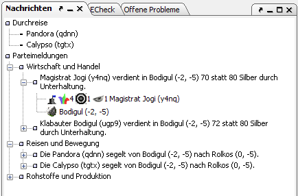

# Meldungen

Hier tauchen die einzelnen Meldungen auf.

Je nach Kontext werden hier die entsprechenden Meldungen angezeigt. Hat man eine Einheit ausgewählt, so werden dort Meldungen, die diese Einheit betreffen angezeigt (Übergaben, Einnahmen, Fehlermeldungen, Einheitenbotschaften, Effekte). Hat man seine Partei ausgewählt, so werden dort alle Meldungen des kompletten Reports angezeigt. Bei Auswahl einer Region stehen, dort die Regionsmeldungen (Effekte, Silberspenden, die man erhalten hat, Durchreisen). Bei Auswahl eines Gebäudes/Schiffes werden dort eventuell bestehende Effekte angezeigt.

Zu jeder Meldung kann man sich die betreffenden Einheiten anzeigen lassen, die von dort aus auch durch Anwahl direkt zur aktiven Einheit gemacht werden können.
