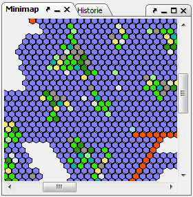

# MiniMap

Die Übersichtskarte stellt eine stark verkleinerte Karte dar, so dass man einen größeren Ausschnitt der Welt betrachten kann. Wählt man dort eine Region aus, so wird die Karte auf die ausgewählte Region zentriert und der Regionsbaum an der Region geöffnet. Ebenso wie bei der großen Karte hat man hier eine Vielzahl von [Einstellmöglichkeiten](../menus/extras/options_map.md).
