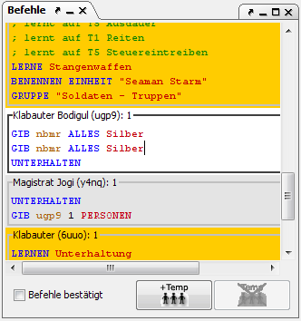

# Befehle

Dieses Fenster dient dazu seinen Einheiten, neue Anweisungen zu geben.

Ist eine Einheit angewählt, werden die Befehle der Einheit hier dargestellt und können verändert werden. Magellan zeigt nur Befehle von Einheiten an, wenn für die entsprechende Partei ein Password gesetzt wurde. Wenn hier also keine Befehle auftauchen, muss man in der [Parteistatistik](../menus/extras/factionstatistics.md) für seine Partei zuerst ein Password angeben.

Die Befehlseingabe wird durch eine komfortable Auto-Vervollständigen-Funktion unterstützt, die flexibel an die eigenen Bedürfnisse [angepasst](../menus/extras/options_detail.md) werden kann. Um einen Befehl einzugeben muss man nur dessen Anfangsbuchstaben eingeben. Aus der nun erscheinenden Vorschlagsliste kann man nun mittels der Cursortasten oder STRG-up bzw. STRG-down den passenden Befehl auswählen und mit der TAB-Taste einfügen. Die Auto-Vervollständigen-Funktion kann im Menü [Extras/Optionen/Detailanzeige](../menus/extras/options_detail.md) konfiguriert werden.

Mit **_Befehle bestätigt_** (Strg+B) kann man die Befehle der aktiven Einheit bestätigen. Die Einheit wird darauf im Regionsfenster nicht mehr fett dargestellt. Man kann mit dieser Funktion also Einheiten markieren, die man bereits bearbeitet hat.

## TEMP-Einheiten

Magellan bietet eine komfortable Möglichkeit mit TEMP-Einheiten zu arbeiten. Dabei werden TEMP-Einheiten wie normale Einheiten unter ihrer Erzeugereinheit dargestellt. Übergaben von Personen und Gegenständen und auch Talente und Gewichte werden dabei in der Detailanzeige wie bei normalen Einheiten dargestellt. Die Befehle zur Erzeugung der TEMP-Einheit (MACHE TEMP \[...\] ENDE) werden von Magellan erst beim Exportieren der Befehle erzeugt. Innerhalb Magellan werden TEMP-Einheiten behandelt wie alle anderen Einheiten auch.

### TEMP-Einheiten erschaffen (Strg+T)

Mit einem Klick auf diesen Button wird eine TEMP-Einheit erzeugt. Dabei können in folgendem Dialog Einheitenname und TEMP-ID eingegeben werden. Die entsprechenden Befehle werden dabei automatisch erzeugt.

Nach einem Klick auf  
_Mehr_ erscheint folgender Dialog:

Hier kann zusätzlich die Anzahl der zu rekrutierenden Personen, ein Befehl und die Einheitenbeschreibung angegeben werden.

### TEMP-Einheiten löschen (Strg+Umschalt+T)

Bei Klick auf diesen Button wird die aktuelle TEMP-Einheit gelöscht.
