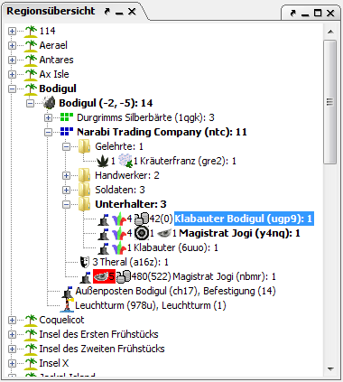

# Regionsübersicht

Im Regionsfenster werden alle Einheiten und Regionen in einer Baumstruktur dargestellt. Die Abfolge der Struktur ist die folgende (in absteigender Reihenfolge):

1. Inseln
2. Regionen
3. Parteien / Gebäude / Schiffe / Straßen
4. Einheiten

Knotenpunkte, unterhalb denen sich noch Einheiten mit [unbestätigten Befehlen](orders.md) befinden, werden in Fettschrift dargestellt andere in normaler. Die Anzeige im Regionsfenster lässt sich in den [Optionen](../menus/extras/options_region.md) in weiten Bereichen an den jeweiligen persönlichen Geschmack anpassen.

Einheiten und Regionen und andere Knoten haben ein Kontextmenü, das sich auf einen Rechtsklick hin öffnet. Dort hat man folgende Optionen:

* **Kopiere Nummer**  
    Kopiert die Einheitennummer in die Zwischenablage
* **Kopiere Name+Nummer**  
    Kopiert die Einheitenname und -nummer in die Zwischenablage
* **Verberge Identität**  
    Erzeugt folgede Befehle um die Einheit zu tarnen:  
    NUMMER EINHEIT  
    BENENNEN EINHEIT ""  
    BESCHREIBE EINHEIT ""  
    TARNEN PARTEI  
    Die alten Werte werden dabei ebenfalls als persistente Kommentare eingefügt, so dass man die Aktion später relativ einfach rückgängig machen kann.
* **Zur Insel hinzufügen/Aus Insel entfernen**  
    So kann man Inseln erzeugen, um Regionen zu gliedern
* **Schiffe befehligen**  
    Hiermit kann man einem oder mehreren ausgewählten Schiffskapitänen Befehle geben.
* **Schiffsroutenplaner**  
    Hiermit kann man einmalige oder dauerhafte Routen für ein oder mehrere Schiffe planen.

Den Parteiknoten ist eine **Allianzstatusanzeige** vorangestellt, die die HELFE-Stati, die zu dieser Partei bestehen, anzeigt. Ein grünes Quadrat bedeutet dabei, dass der entsprechende HELFE-Modus gesetzt ist, ein rotes Quadrat bedeutet, dass er nicht gesetzt ist. Die Bedeutungen der Quadrate sind von links nach rechts: Silber, Kämpfe, Gib, Bewache, Parteitarnung. Die eigene Partei (bzw. die Partei auf deren Allianzen die Statusanzeige beruht) ist dabei blau dargestellt.

Wählt man mehrere Einheiten aus, so bietet das Kontextmenü (rechte Maustaste) die Option "Befehl geben". Diese öffnet einen Dialog mit dem man allen ausgewählten Einheiten den selben Befehl geben kann.
