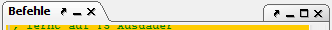

# Menü Desktop

Das Desktop-Menü hat folgende Punkte:

* [Layout](layout.md)
* [Tabs verbergen](hidetabs.md)

Innerhalb des Desktopmenüs findet man Funktionen, um das Aussehen von Magellan an die eigenen Wünsche anzupassen. Seit Magellan 2.0 gibt es ein neues Layout Konzept, das auf sogenannten [Docks](../../docks/index.md) basiert. Dabei sind einzelne Elemente des Fensters frei verschiebbar und sogar vom Hauptfenster Magellans lösbar, um sie zum Beispiel auf einem zweiten Bildschirm zu platzieren.

Unterhalb der oben genannten Menüpunkte sieht man alle gerade für Magellan bekannten [Docks](../../docks/index.md). Jedes dieser Docks stellt einen bestimmten Teil von Magellan dar. Das kann die Regionsübersicht, die Befehle oder die Karte sein. Jedes dieser Docks besitzt am oberen Rand rechts einige Funktionsbuttons, die wir hier im folgenden genauer erklären.

Die Schaltflächen können je nach System geringfügig anders aussehen. Ihre Bedeutung ist (von links nach rechts):

* Der Name des Docks. Durch Klicken und ziehen kann man dieses Dock auch an eine andere Stelle ziehen. Dabei muss unterschieden werden, ob man das Tab in einen Bereich zieht - dadurch werden die Docks nun über- oder nebeneinanderdargestellt - oder ob man es auf den Kopfbereich eines anderen Docks zieht - dadurch werden die Docks als Tabs "hintereinander" dargestellt, es ist also jeweils nur ein Dock sichtbar.
* **Undock** Hiermit kann das Dock "freischwebend" dargestellt werden, also als ein eigenes Fenster. In diesem Fall verändert sich diese Schaltfläche zu **Dock**, womit sie wieder in das Hauptfenster integriert werden kann.
* **Minimieren** Das Dock wird auf eine kleine Schaltfläche unten im Hauptfenster reduziert. Die Schaltfläche verändert sich zu **Wiederherstellen**, wodurch das Dock wieder normal dargestellt wird.
* **Schließen** Das Dock wird versteckt und kann über das Desktopmenü wieder angezeigt werden.

Die Schaltflächen in der linken oberen Ecke betreffen dabei jeweils nur ein einzelnes Dock, die in der rechten oberen Ecke beziehen sich auf eine ganze Tab-Gruppe.
