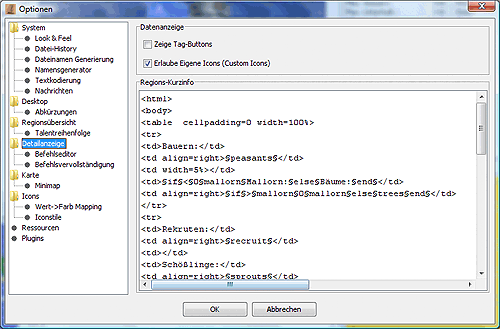

# Detailanzeige

In diesem Dialog können die Optionen der Detailanzeige und der Befehlsergänzung konfiguriert werden:

## Datenanzeige

* **Zeige Tag-Buttons**  
    Ist diese Option aktiviert werden in der Detailanzeige zwei Schaltflächen zum Hinzufügen und Enfernen von zusätzlichen CR-tags angezeigt, die man dann z.B. mit Vorlage auswerten kann.
* **Erlaube eigene Icons**  
    Damit ist es möglich, eigenen Einheiten und Parteien ein eigenes Icon zuzuordnen. Diese Icons müssen im Unterverzeichnis `etc/images/icons/custom` abgelegt werden.  
  * Für Parteien muss eine GIF Datei wie folgt abgelegt werden: `etc/images/icons/custom/factions/<parteinummer>.gif`
  * Für Einheiten muss eine GIF Datei wie folgt abgelegt werden: `etc/images/icons/custom/units/<einheitennummer>.gif`
* **Regionskurzinfo**  
    In diesem Feld können die Regionsinhalte bestimmt werden, die permanent in dem grauen Bereich oberhalb der Detailanzeige eingeblendet werden. Dieser Text benutzt dasselbe Ersetzersystem wie der ATR. Hier gibt es [eine genauere Beschreibung des Ersetzersystems](../../reference/atr_arr.md).

## Befehlseditor

* **Multi-Editor Layout**  
    Wird diese Option aktiviert, stehen die Befehle aller Einheiten der Region untereinander im Befehlsfenster.  
    Ist das Multi-Editor Layout deaktiviert, stehen nur die Befehle der gerade gewählten Einheit im Befehlsfenster.
* **Knöpfe verstecken**  
    Wählt man diese Funktion, dann werden die TEMP-Knöpfe unten nicht angezeigt und man gewinnt etwas Platz.
* **Alle Parteien editierbar**  
    Normalerweise können nur Befehle von Parteien gesehen und bearbeitet werden, die _privilegiert_ sind. Im Normalfalle ist das die Partei, deren Passwort bekannt ist und für die Befehle erstellt werden.  
    Für besondere Konstellationen kann es gewünscht sein, auch von anderen Parteien die Befehle zu sehen und zu editieren, um zum Beispiel eine geplante Übergabe zu simulieren und das resultierende Gewicht zu prüfen. Für eine Darstellung und Änderung der Befehle von nicht-privilegierten Dateien muss diese Funktion aktiviert sein.
* **Farben**  
    Der Hintergrund der Befehlsbox kann dabei für die aktive Einheit anders eingefärbt werden als für die übrigen Einheiten. Dazu klickt man einfach auf das jeweilige Farbfeld.
* **Syntaxhighlighting**  
    Hier kann man das Syntaxhighlighting (syntaxabhängige Färbung der Befehle) aktivieren und die Farben einstellen.
* **Editor-Liste**  
    Die Einstellungen beeinflussen die Menge der dargestellten Einheiten im der Befehlsliste. Einschränken lässt sich diese Menge der dargestellten Einheiten auf Inseln, Regionen und Parteien.

### Befehlsvervollständigung

Die automatische Befehlsvervollständigung erleichtert das Eingeben von Befehlen für die Einheiten. Dabei werden je nach Kontext sinnvolle bzw. mögliche Befehle vorgeschlagen und können mit wenigen Tastendrücken oder Klicks ausgewählt werden.

Beispiel:  
Man tippt ein "G". Nun werden alle Befehle, die mit "G" beginnen zur Auswahl angezeigt. Nach Auswahl des Befehls "GIB" folgt hier eine Liste aller Einheiten in der Region. Nachdem so die Einheitennummer eingegeben wurde erscheint eine Liste mit allen Gegenständen, die die Einheit besitzt.

* **Autovervollständigen aktivieren:**  
    Hier kann man die automatisch Befehlsvervollständigung de- und aktivieren.
* **MACHEN-Ergänzung einschränken:**  
    Wenn diese Option gewählt ist, werden beim MACHEN-Befehl nur Gegenstände vorgeschlagen für die die notwendigen Ressourcen verfügbar sind.
* **Sofortige Anzeige:**  
    Aktiviert die sofortige Anzeige der Befehlvorschläge nach der Eingabe eines Befehls. Das bedeutet, dass der nächste Teilbefehl vorgeschlagen wird, bevor der Wortanfang getippt wurde. Ist diese Option deaktiviert, muss man vor dem Befehlsvorschlag min. 1 Zeichen tippen.
* **Zeit:**  
    Im Feld _Zeit_ kann man die Verzögerung für die Anzeige des Befehlsvorschlages in Millisekunden einstellen.
* **Modus:**  
    Für die Autovervollständigung stehen zwei Modi zur Verfügung:
  * Liste  
        Sobald ein oder mehrere Zeichen eingegeben wurden, erscheint eine Liste mit möglichen Ergänzungen. Jede weitere Eingabe von Zeichen schränkt die Auswahl weiter ein.  
        Beispiel:  
        L -> "LEHREN, LERNEN, LIEFERE"  
        LE -> "LEHREN, LERNEN"  
        LEH -> "LEHREN"  
        Man kann in der Liste mittels der Cursortasten nach oben und unten wandern. Ein Druck auf die TAB-Taste oder ein Doppelklick auf den Eintrag vervollständigt den Befehl.  

  * Markierter Text  
        Statt der Auswahlliste wird das Wort bis zur nächsten Unterscheidungsmöglichkeit vervollständigt. Der eingefügte Text ist markiert und wird so beim Weitertippen überschrieben. Den Vorschlag übernimmt man auch hier mit der TAB-Taste.  

  * Keine Anzeige  
        Schaltet die Anzeige der Vorschläge ab. Das Einfügen der (unsichtbaren) Vorschläge ist dennoch möglich.
* Bei den Eingabefeldern für **Vorwärts, Rückwärts, Einsetzen** und **Abbrechen** kann man die Tastenkombinationen für die jeweiligen Funktionen einstellen. **Vorwärts** springt einen Vorschlag vor, **Rückwärts** springt einen Vorschlag zurück, **Einsetzen** setzt den aktuellen Vorschlag ein und mit **Abbrechen** wird die Eingabe abgebrochen.  

* **Selbstdefinierte Befehlsergänzungen**  
    Im unteren Bereich des Fensters hat man die Möglichkeit, selbst beliebige Kürzel zu definieren, die dann bei den Befehlsergänzungen vor den normalen Befehlen angezeigt werden. Hat man z.B. das Kürzel _lh_ für _lernen Hiebwaffen_ definiert, so wird das analog dem obigen Beispiel folgendermaßen angezeigt:  
    L -> "lh, LEHREN, LERNEN, LIEFERE"  
    LE -> "LEHREN, LERNEN"  
    Wählt man während der Befehlserstellung das Kürzel aus, so wird der definierte Textbaustein anstatt des Kürzels eingesetzt. Dieser Baustein kann auch länger als eine Zeile sein.  
    Im linken Teil der Anzeige befindet sich eine Liste der bisher definierten Kürzel. Wählt man eines der Kürzel mit der Maus aus, so wird im rechten Teil der Anzeige der dazugehörige Textbaustein angezeigt. Mittels der Schaltfläche _**Hinzufügen**_ lassen sich neue Kürzel definieren, während die Schaltfläche _**Entfernen**_ das gerade ausgewählte Kürzel aus der Liste löscht.
