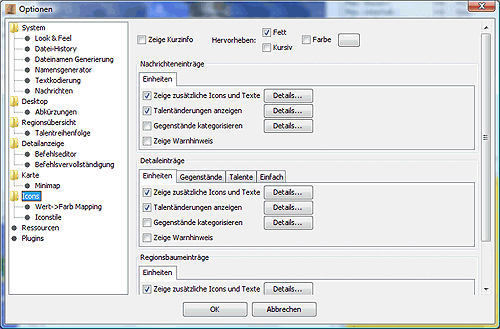
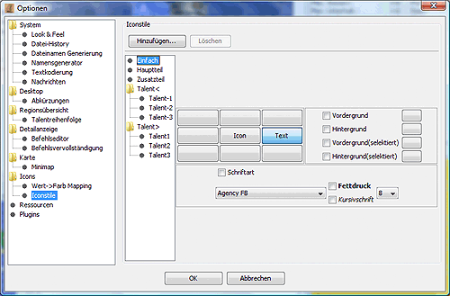

# Icons

## Iconeinstellungen

**Zeige Kurzinfo:** Ist diese Option aktiviert, erhält man bei etwas längerem Verweilen des Mauszeigers über einem Icon den dazugehörigen Talent- oder Gebäudenamen, den das Icon repräsentiert.

**Nachrichten/Details/Regionen**: In dem jeweiligen Bereich sind die Optionen zusammenfefasst, die sich auf der jeweilige Panel beziehen.

In Abhängigkeit von dem jeweiligen Bereich werden verschiedene Unteroptionen in der Form von Reitern am linken Rand zur Verfügung gestellt. Die Feineinstellung der jeweiligen Unteroptionen erfolgt in einem extra Fenster, das sich durch Betätigung der Schaltfläche _**Details**_ öffnen lässt.

* **Einheiten-Reiter**  
    Dieser Reiter bezieht sich auf die Zeile, in der der Name der Einheit steht. Zusätzlich zu dem Namen können noch weitere Informationen angezeigt werden.
  * **Zeige zusätzliche Icons und Texte**  
        zeigt Icons für Talente, Gegenstände und Aufenthaltsort der Einheit an.
  * **Talentänderungen anzeigen**  
        wenn man einen zusätzlich einen Report der Vorwoche geladen hat, lassen sich damit Talentänderungen anzeigen.
  * **Gegenstände kategorisieren**  
        Fasst unterschiedliche Gegenstände zusammen, z.B. alle Waffen.
* **Talente-Reiter**  
    Dieser Reiter bezieht sich auf die aufklappbaren Zeilen unterhalt des Einheitennamens im Detailfenster, die die unterschiedlichen Talente der Einheit beinhalten.
  * **Zeige Informationen zum nächsten Level**  
        zeigt an wie lange noch bis zum nächsten Level gelern werden muss, sofern dies vom Spiel unterstützt wird.
  * **Talentänderungen anzeigen**  
        wenn man einen zusätzlich einen Report der Vorwoche geladen hat, lassen sich damit Talentänderungen anzeigen.
* **Gegenstände-Reiter**  
    Dieser Reiter bezieht sich auf die aufklappbaren Zeilen unterhalt des Einheitennamens im Detailfenster, die die Gegenstände der Einheit auflisten.
  * **Regionsanzahl anzeigen**  
        zeigt hinter den Gegenständen die Gesamtanzahl der Gegenstände in der Region an.
* **Einfach-Reiter**  
    Dieser Reiter bezieht sich auf die sonstigen Zeilen im Detailfenster.
  * **Zeige Icons**  
        zeigt zu Beginn der Zeile ein Icon, sofern für die angezeigte Information eins existiert.

## Wert->Farbmapping

Hier kann die Schriftfarbe für die Talentwertanzeige im Regionsfenster nach Talentwerten konfiguriert werden. Sind hier keine Farben definiert, so wird schwarz verwendet.

## Iconstile

Hier lässt sich die Art der Anzeige im Regionsfenster konfigurieren.

* **Einfach**  
    bezieht sich auf Icons denen kein eigener Stil zugeordnet ist, die Default-Einstellung.
* **Hauptteil**  
    bezieht sich auf Regionsnamen und Parteinamen.
* **Zusatzteil**  
    bezieht sich auf die Einheiten.

Die Einstellmöglichkeiten gliedern sich in folgende Punkte auf:

* Lage des Namens oder Textwertes in Bezug auf das Icon
* vom Standardvorgaben abweichende Schriftarten und -größen
* vom Standard abweichende Hintergrund- und Vordergrund/Schrift-Farbe

Des weiteren hat man hier mittels der Schaltfläche _**Hinzufügen**_ die Möglichkeit, eigene Iconstile zu definieren, die man dann z.B. mit Vorlage aktivieren kann. Im CR müssen sie im Kontext von Einheiten in der Form _"Iconstilname";magStyle_ stehen. Mit der Schaltfläche _**Löschen**_ lassen sich die selbstdefinierten Iconstile wieder löschen.

Wenn man die Talentänderungen per Stylesheet anzeigen lässt, so befinden sich die dafür benötigten Iconstile ebenfalls in dieser Liste, und zwar unter dem Namen _Talentx_, wobei x die Zahl zu der entsprechenden Stufenänderung ist.
