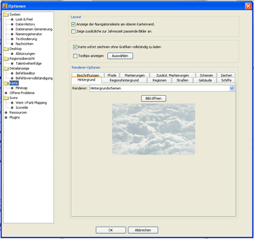
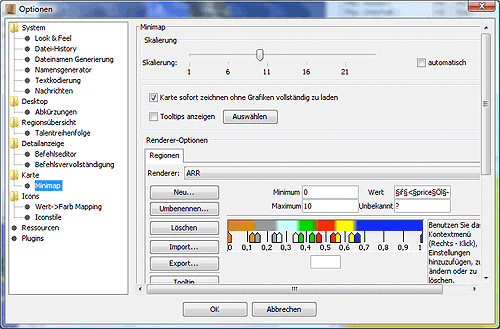

# Karte

Hier lässt sich die Art der Anzeige auf der Karte und der Übersichtskarte konfigurieren. Die Karte wird von verschiedenen "Renderern" gezeichnet, die sich hier getrennt voneinander konfigurieren und abschalten lassen.

**Anzeige der Navigationsleiste am oberen Kartenrand.**  
Oberhalb der Hauptkarte können einige Einstellmöglichkeiten eingeblendet werden. Zum einen ein Regler für die Vergrößerung oder Zoom der Karte, weiterhin eine Auswahlmöglichkeit des angezeigten Levels bzw. der angezeigten Ebene und abschließend kann, falls Hotspots definiert wurden, zu diesen Hotspots gesprungen werden.

Diese Möglichkeiten nehmen ein wenig Platz ein und können deaktiviert werden, die Funktionalität ist dann lediglich über einen Rechtsklick in die Karte nutzbar. Das erscheinende PopUp-Menu (Kontextmenü) enthält die entsprechenden Menüpunkte.

**Zeige zusätzliche zur Jahreszeit passende Bilder an** Schneebedeckte Berge im Winter und Eisschollen an den Meeresküsten - werden nur angezeigt, wenn diese Einstellung ausgewählt worden ist. Ist sie nicht aktiviert, wird das Standardgrafikset für alle Jahreszeiten benutzt.

**Karte sofort zeichnen, ohne Grafiken vollständig zu laden**  
Ist diese Option aktiviert, wird nach dem Laden des CR sofort mit dem Zeichnen der Karte begonnen ohne zunächst alle Regionsgrafiken in den Cache zu laden. Damit ist die initiale Darstellung der Karte etwas schneller, allerdings werden nur die Grafiken von Regionstypen geladen, die auf dem aktuellen Kartenabschnitt vorkommen. Somit kann es beim Verschieben des Kartenausschnittes zu Verzögerungen kommen wenn noch Regionsgrafiken nachgeladen werden müssen.

**Tooltips anzeigen**  
Wenn diese Option aktiviert ist, werden beim Verweilen der Maus über Regionen auf der Karte Tooltips dargestellt in denen Regionsnamen, Typ, Bauern und Poolsilber angezeigt werden.

## Hauptkarte

Die Rendering-Ebene unterteilt die Darstellung in logische Unterobjekte, wie Regionen, Straßen, Gebäude etc., deren jeweilige Einstellmöglichkeiten, dann im Kasten unterhalb eingeblendet werden.

### Regionen

* &lt;inaktiv&gt;  
    Regionen werden nicht dargestellt.
* **Regionsrenderer**  
    Dies ist die Default-Einstellung, bei der die Regionen mit Grafiken dargestellt werden.
* **Regionsrenderer (geometrisch/politisch)**  
    Dieser Modus stellt die Regionen als unterschiedlich farbige Flächen dar. Folgende Darstellungsmodi sind möglich
  * **Regionstyp**  
        Hier läßt sich jeden Regionstyp (Berg, Sumpf etc.) eine Farbe zuordnen.
  * **Politisch**  
        Ist dieser Modus aktiv, so wird die Region in der Farbe eingefärbt, die der Partei mit den meisten Personen in der Region zugeordnet ist.
  * **Alle Parteien**  
        Hier kann man jeder im Report vorhandenen Partei eine Farbe zuordnen. Die Regionen werden, sofern mehr als eine Partei in ihnen vorhanden ist, durch senkrechte Unterteilungen in den den jeweiligen Parteien entsprechenden Farben angezeigt.
  * **Vertrauenslevel**  
        Anzeige der Regionsfarben nach Vertrauenslevel der dortigen Parteien.
  * **Vertrauenslevel (Bewachung)**  
        Anzeige der Regionsfarben nach Vertrauenslevel der bewachenden Parteien.
* **ARR (advanced region renderer)**  
    Dieser Modus gibt einen die Möglichkeit die Darstellung der Region in Abhängigkeit von selbst erstellten Bedingungen zu gestalten. Mehr Informationen findest du in der [Beschreibung des Ersetzersystems](../../reference/atr_arr.md).

    Bei allen Einstellungen ist zu beachten, dass die Farbzuordnung der Parteien für alle unterschiedlichen Darstellungsmodi identisch ist.

### Straßen

* &lt;inaktiv&gt;  
    Straßen werden nicht dargestellt.
* **Straßenrenderer**  
    Dies ist die Default-Einstellung, bei der die Straßen mit Grafiken dargestellt werden.

### Gebäude

* &lt;inaktiv&gt;  
    Gebäude werden nicht dargestellt.
* **Gebäuderenderer**  
    Dies ist die Default-Einstellung, bei der die Burgen mit Grafiken dargestellt werden.

### Schiffe

* &lt;inaktiv&gt;  
    Schiffe werden nicht dargestellt.
* **Schiffsrenderer**  
    Ist diese Option aktiv, so werden vorhandene Schiffe auf der Karte dargestellt. Angelegte Schiffe werden an der jeweiligen Anlegeküste dargestellt, Schiffe im Bau und auf dem Ozean in der Mitte der Region.

### Beschriftungen

* &lt;inaktiv&gt;  
    Regionsnamen werden nicht dargestellt.
* **Regionsnamenrenderer**  
    Ist diese Option aktiv, so wird der Name über der jeweiligen Region eingeblendet. Zusätzlich besteht hier die Möglichkeit Schriftart und -typ einzustellen.
* **Handelsrenderer** Ist diese Option ausgewählt, werden das Handelsgut und -menge angezeigt.
* **ATR** Hiermit kann man eine Beschriftung selbst definieren. Mehr Informationen findest du in der [Beschreibung des Ersetzersystems](../../reference/atr_arr.md).

### Pfade

* &lt;inaktiv&gt;  
    Pfade werden nicht dargestellt.
* **Pfadrenderer**  
    Ist diese Option aktiv, so werden Pfeile auf der Karte eingeblendet, wenn eine gerade aktive Einheit einen NACH oder ROUTE Befehl hat.

### Markierungen

* &lt;inaktiv&gt;  
    Markierungen werden nicht dargestellt.
* **Markierungsrenderer**  
    Ist diese Option aktiv, so wird die gerade aktive Region durch einen weißen Umriß hervorgehoben und markierte Regionen werden mit einem diffusen Nebel versehen (je nach geladenem [Grafikset](../../reference/graphicsets.md) unterschiedlich).
* **Markierungsrenderer (geometrisch)**  
    Ist diese Option aktiv, so wird die gerade aktive Region durch einen roten Umriss hervorgehoben und markierte Regionen werden mit einem weißen Umriss versehen.

### Zusätzl. Markierungen

* &lt;inaktiv&gt;  
    Zusätzliche Markierungen werden nicht dargestellt.
* **Zusätzl. Bilder**  
    Ist diese Option aktiv, so können eigene Bilder auf der Karte eingeblendet werden. Dazu muss muss z.B. mit Vorlage innerhalb des Regionskontextes das tag _"Bildname";regionicon_ gesetzt werden. Die Bilder selber müssen sich unterhalb des magellan.jar Verzeichnisses im Pfad /res/images/map befinden und dem unter [Grafikset erstellen](../../reference/graphicsets_making.md) beschriebenen Format entsprechen.

## MiniMap

Die Übersichtskarte beherrscht alle Darstellungsmodi des Regionsrenderers (geometrisch/politisch). Die Farbzuordnung ist demnach auch bei diesem einzustellen. Auch die Skalierung der MiniMap kann hier eingestellt werden.
