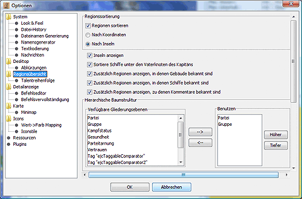

# Regionsübersicht

In diesem Dialog kann man die Optionen der [Regionsübersicht](../../docks/regions.md) einstellen:

* **Regionssortierung**  
    Hier kann man die Anzeige der Regionsnamen nach Koordinaten oder nach Inselzugehörigkeit einstellen. Wird zusätzlich die Option _Inseln anzeigen_ aktiviert, wird den Regionen noch ein "Ordnungsknoten" für die Insel vorangestellt, der auf- und zugeklappt werden kann.

    Magellan kann die Regionen eines Reports in Inseln einteilen und sie in der Regionübersicht nach Insel geordnet darstellen. Prinzipiell sind auch weitere Einsatzmöglichkeiten für Inseln denkbar.

    Mit dem Menüpunkt '[Inseln erfassen](menu_map_island.md)' im Menü 'Extras' wird die Zuordnung von Inseln zu Regionen vorgenommen. Dies ist Voraussetzung, um die Regionen nach Inseln sortieren zu können.

    Um die Regionsübersicht nach Inseln sortieren zu lassen, sind in diesem Dialog folgende Einstellungen zu machen:
    1. _Regionen sortieren_ aktiviert
    2. _Nach Insel_ ausgewählt
    3. _Inseln anzeigen_ legt fest, ob die Inseln auch tatsächlich in der Übersichtsanzeige dargestellt werden. Nur wenn diese Option aktiviert ist, kann man die Inselnamen und -beschreibungen ändern.
* **Hierarchische Baumstruktur**  
    Hier kann eingestellt werden, welche Gliederungsebenen es in der Regionsübersicht gibt. Voreinstellung sind Partei und Gruppe. Um weitere Ebenen hinzuzufügen, muss man sie in der linken Auswahlbox auswählen und per Pfeil nach rechts übernehmen. Um Ebenen zu entfernen muss man sie rechts auswählen und per Pfeil nach links löschen. Zusätzlich kann man über die "Höher"- und "Tiefer"-Knöpfe die Reihenfolge in der Hierarchie verändern.
* **Einheitensortierung**  
    Die Ausgabe der Einheiten kann hier nach Reportreihenfolge (Reihenfolge der Einheiten im CR), Talentname oder Einheitenname sortiert werden. Bei der Sortierung nach Talenten hat man noch weitere Einstellmöglichkeiten. Voreingestellt ist die Sortierung nach dem besten Talent, d.h. eine Einheit mit Hiebwaffen T6 und Taktik T3 wird also bei den anderen Hiebwafflern einsortiert, und Reihenfolge nach dem Alphabet, d.h. die Holzfäller folgen auf die Hiebwaffler.

    Will man diese Reihenfolge ändern, so kann man im Unterpunkt Talentreihenfolge die Sortierreihenfolge der Talente angeben und so z.B. alle Kampf- oder Produktionstalente in Blöcken anzeigen lassen. Auch ist es möglich mit der Aktivierung des Punktes _Nach höchsten Talent in der Talentreihenfolge_, die Einsortierung von Einheiten mit mehreren Talenten zu beeinflussen. Hat man den Punkt aktiviert und gleichzeitig Taktik in der Talentliste vor Hiebwaffen stehen, so würde die Einheit mit Hiebwaffen T6 und Taktik T3 bei Taktik einsortiert werden.

* **Baum-Expansion**  
    Mittels dieser Optionen lässt sich bestimmen, ob und wie weit der Regionsbaum aufklappt, wenn eine Region auf der [Karte](../../docks/map.md) aktiviert wird. Die Optionen der rechten Spalte beeinflussen dabei das Öffnungsverhalten und die der linken Spalte das Schließverhalten vorher aufgeklappter Regionsinformationen.

## Talentreihenfolge

Die Änderung der Talentreihenfolge erfolgt durch Auswahl des entsprechenden Talentes mit der Maus anschließendes Verschieben durch die Schaltflächen _Höher_ bzw. _Tiefer_.
