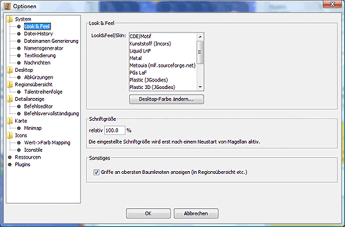
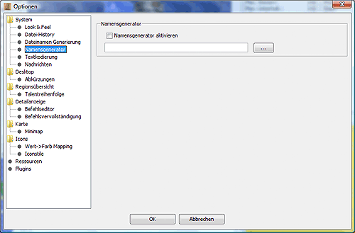
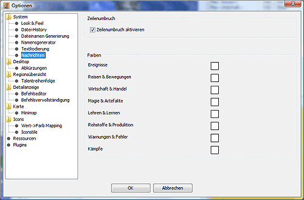

# System

Hier können einige globale Systemeinstellungen gesetzt werden.

* **Spracheinstellungen**  
    Hier kann man die verwendete Sprache für die Magellan-Oberfläche und die Befehle einstellen. Die Änderung wird aus technischen Gründen erst nach einem Neustart von Magellan wirksam.
* **Tempeinheiten**  
    Hier kann man das Verhalten von Magellan bei der Erstellung vom Tempeinheiten festlegen. Ist in dem Feld **_Startwert_** ein Wert eingetragen, so nummeriert Magellan alle erzeugten Tempeinheiten mit dieser Nummer beginnend durch, entweder Dezimal oder im Base36 System, je nach gewählter Einstellung neben dem Kasten. Dies ist z.B. in einem Bündnis sinnvoll, in dem jeder Spieler einen reservierten Nummernbereich für Tempeinheiten zugewiesen bekommen hat, damit nicht Tempeinheiten mit gleichen Nummern in einer Region erzeugt werden.  
    Ist die Option **Bei Temperzeugung Dialog anzeigen** gewählt, wird beim Erstellen von Tempeinheiten ein zusätzliches Fenster eingeblendet, in dem einige Einstellungen vorgenommen werden können.
* **Beim Start auf neuere Version prüfen.**  
    Ist diese Option gewählt, überprüft Magellan beim Start, ob inzwischen eine neue Version von Magellan zum Download bereitliegt. Dazu wird eine Verbindung zum Internet benötigt. Falls eine neue Version vorhanden ist, wird beim Start folgender Dialog angezeigt:  

    

    [https://magellan2.github.io](https://magellan2.github.io) ist dabei die aktuelle Entwickler-Website.
* **Lade beim Start den letzten Report**  
    Hiermit regelt man, ob beim Start von Magellan der zuletzt geladene Report in Magellan geladen wird.
* **Legt Regionen "Leere" an, wo Regionen fehlen**  
    Ist diese Option gesetzt, so werden unbekannte Regionen mit einem Fragezeichen versehen.
* **Fortschrittsanzeige**  
    Wenn man diese Option aktiviert, so wird im Titelbereich des Magellanfenstern der prozentuale Fortschritt angezeigt, d.h. die Anzahl der schon bestätigten Einheiten.

## Look & Feel

* **Look & Feel**
* Hier kann man das Look&Feel der Magellan-Oberfläche auswählen. Standardmäßig stehen hier bereits eine Reihe von Look&Feels zur Verfügung.

  * CDE/Motif
  * Kunststoff
  * Liquird LnF
  * Metal
  * Metouia (sf)
  * PGs LnF
  * Plastic (JGoodies)
  * Plastic 3D (JGoodies)
  * Plastic XP (JGoodies)
  * SH Farr
  * Squereness
  * Tiny LnF
  * Windows
  * Windows XP

    Zusätzlich kann Magellan auch mit so genannten Skins versehen werden. Dafür benötigt man so genannte Themepacks, die in das Unterverzeichnis 'skins' gelegt werden müssen. (Wenn z.B. magellan.jar im Verzeichnis C:\\magellan\\ liegt, dann muss skinlf.jar auch in das Verzeichnis C:\\magellan\\ und z.B. das Themepack whistlertheme.zip in das Verzeichnis C:\\magellan\\skins\\). Passende Themepacks findet man unter [www.mylookandfeel.com](http://mylookandfeel.l2fprod.com/portal.php3?action=plaf&id=skinlf).
* **Schriftgröße**  
    Hier kann man die relative Größe der Systemschrift einstellen. Die Änderung wird aus technischen Gründen erst nach einem Neustart von Magellan wirksam.
* **Griffe an oberster Baumebene anzeigen**  
    Damit ist gemeint, dass man den obersten Baumknoten (etwa in der [Regionsübersicht](../../docks/regions.md)) ebenfalls noch sieht und so den Baum komplett noch zusammenklappen kann. Wird dieser Knoten nicht angezeigt, muss man die Knoten der obersten Ebene per Doppelklick aufklappen.

## Datei-History

Der hier eingetragene Wert bestimmt, wieviele zuletzt geladene Reports im Datei-Menü erscheinen.

## Dateinamen-Generierung

Wenn man hier etwas einträgt, wird beim [Dialog zum Speichern der Befehle](../file/saveorders.md)  ein Dateiname vorgeschlagen. Ein Beispiel wäre {round}-{factionnr}-neu.txt .

## Namensgenerator

Wenn man diese Option aktiviert und dazu eine Textdatei einbindet, in der zeilenweise Namen aufgeführt sind, so kann man diese bei der Erstellung neuer Einheiten auswählen.

## Textkodierung

Hier kann man festlegen, wie Magellan die Reports und Befehle kodiert. Es gibt prinzipiell drei Kodierungsformen.

* System - ist die Kodierung des Systems und entspricht heute meist UTF-8.
* ISO-8859-1 - ist das Standardformat für die meisten Dateien im mitteleuropischen Raum
* UTF-8 - ist die Zukunft.

Wir empfehlen sehr, alle Reports und Befehle in UTF-8 zu kodieren. Der Eressea Server unterstützt dies mittlerweile durchgehend. Einzig einige wenige Tools haben damit ein Problem.

## Nachrichten

* **Zeilenumbruch**  
    Aktiviert man die Option _Aktiviere Zeilenumbruch_, so werden die Nachrichten, die zu lang für die Breite des Nachrichtenfensters sind, umgebrochen. Es entsteht also kein horizontaler Scrollbalken.
* **Farben**  
    Hier kann man für die verschiedenen Nachrichtentypen verschiedene Hintergrundfarben definieren und so für Aufmerksamkeit sorgen. Standardmäßig ist die Hintergrundfarbe weiß.
