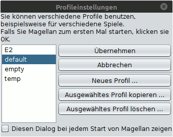

# Profile

Dieser Dialog wird auch angezeigt, wenn Magellan zum ersten Mal gestartet wird. Hiermit ist es möglich, mehrere Profile anzulegen, jedes mit seinen eigenen Einstellungen. So können zum Beispiel mehrere Personen mit verschiedenen Vorlieben Magellan benutzen oder man kann verschiedene Einstellungen für verschiedene Spielvarianten oder bestimmte Aufgaben anlegen.

Zwischen den Profilen kann man nur durch einen Neustart von Magellan tatsächlich wechseln. Man muss also das neue Profil auswählen, Magellan beenden und dann neu starten.
