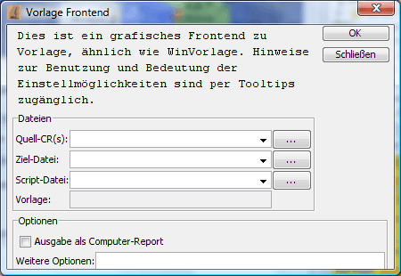

# Vorlage

Dies ist ein grafisches Frontend für Vorlage. Vorlage ist ein leistungsfähiger Zugvorlage-Generator für Eressea und andere kompatible Spiele, der auch eine Metasprache zur Automatisierung bietet. Man kann Vorlage unter [http://www.gulrak.de/etools.html](http://www.gulrak.de/etools.html) downloaden. Eine Dokumentation findet sich ebenfalls dort.

Nach Auswahl des Menüpunktes öffnet sich folgender Dialog:

Im Feld **_Quell-CR(s)_** gibt man den Pfad zu einem oder mehreren CRs an, die von Vorlage bearbeitet werden sollen. Normalerweise ist dies der CR, der vom Eressea-Server geschickt wurde.

Das Feld **_Ziel-Datei_** dient zur Bestimmung des Files in das Vorlage seine Ausgebe schreiben soll.

Die im Feld **_Script-Datei_** angegebene Datei verwendet Vorlage zur Einbindung externer Funktionen und Prozeduren zur Bearbeitung der Metabefehle. Näheres zu Vorlage-Scripts findet man in der Vorlage-Dokumentation.

Das Feld **_Vorlage_** enthält schließlich den Pfad zu Vorlage.

Im Block **_Optionen_** kann man Kommandozeilenoptionen für Vorlage angeben. Der Schalter **_Ausgabe als Computerreport_** erzeugt dabei die -cr Option. Weitere Optionen kann man bei Bedarf in das entsprechende Feld eintragen.

Bei Klick auf **_Ok_** wird Vorlage mit den eingestellten Optionen aufgerufen. Den dabei erzeugten CR bzw. die erzeugte Befehlsdatei kann man nun in Magellan laden und weiterbearbeiten.

Im Fenster **_Ausgabe_** wird die Ausgabe von Vorlage dargestellt, so dass man eventuelle Fehlermeldungen sehen kann.
