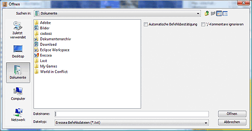

# Befehle öffnen

Hier kann man eine Eressea-Befehlsdatei hinzuladen, die auch mit anderen Tools erstellt werden kann. Bei Auswahl des Menüpunktes erscheint folgende Dialogbox:

Sie entspricht weitgehend dem bekannten Dateiauswahldialog. Es gibt jedoch zwei zusätzliche Optionen:

* **Automatische Befehlsbestätigung**:  
    Wird diese Option gewählt, werden die Befehle beim Import gleich bestätigt.  

* **';'-Kommentare ignorieren**:  
    Kommentare die mit einem ';' beginnen werden nicht importiert. Dabei wird natürlich auch der Bestätigungsstatus der Einheiten ignoriert, da diese als ;-Kommentar gespeichert werden.
