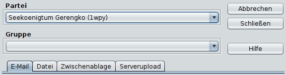
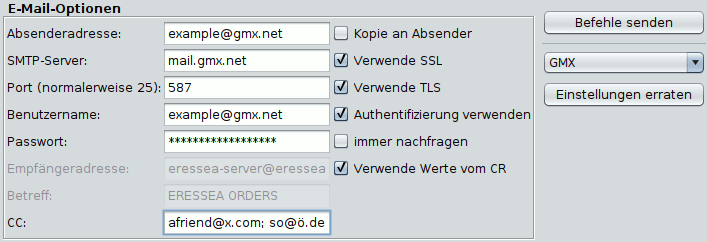
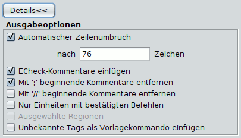

# Befehle speichern

Zum Speichern oder Verschicken der Befehle stehen folgende Optionen (Reiter) zur Verfügung:

* **E-Mail**  
    Verschickt die Befehle direkt per Mail. Magellan kann für einige populäre Mailprovider die nötigen Einstellungen erraten. Dann müssen Sie nur noch das Passwort eingeben. Sollte dies nicht möglich sein können Sie die restlichen Einstellungen selber ausfüllen. Falls Sie die Einstellungen nicht kennen, hilft häufig eine einfache Internetsuche nach "SMTP-Einstellungen für Providername". Bei manchen Providern muss man diese Funktion erst in den Emaileinstellungen freischalten. Besuchen Sie dazu die Internetseite Ihres Providers. Diese Einstellungen haben nichts mit Eressea zu tun, aber die Eressea-Community hilft in solchen Fragen gerne weiter, wenn man nett fragt.  
    
  * **Einstellungen erraten**  
        Versucht die Servereinstellungen aus der Absenderadresse zu erraten oder bietet die Möglichkeit, aus einer Liste populärer Anbieter auszuwählen.
  * **Absenderadresse**  
        Ihre Emailadresse, von der aus die Befehle verschickt werden sollen.
  * **SMTP-Server**  
        Hier trägt man den Mailserver seines Internetproviders ein (zum Beispiel smtp.provider.de).
  * **Port**  
        Diese Einstellungen müssen Sie über ihren Provider in Erfahrung bringen. Gängige Werte sind 25, 465 oder 587.
  * **Verwende SSL / Verwende TLS**  
        Diese Einstellungen hängen vom Protokoll ab, die ihr Provider verwendet. Versuchen Sie im Zweifel, beide auszuwählen.
  * **Authentifizierung verwenden**  
        Für die meisten Provider muss dieses Kästchen heutzutage aktiviert sein.
  * **Benutzername**  
        Häufig identisch mit der Absenderadresse, aber auch dies hängt vom Provider ab.
  * **Passwort**  
        Magellan kann ihr Passwort speichern. Dies bedeutet ein gewisses Risiko, falls jemand mit unlauteren Absichten Zugriff auf ihren Computer erlangt. Sie können das Häkchen bei "immer nachfragen" setzen, dann müssen Sie das Passwort jedes Mal neu eingeben, dafür ist es sicherer.
  * **Empfängeradresse**  
        Hier wird die Mail-Adresse des Eressea-Servers angegeben. Magellan kann sie normalerweise aus dem Report auslesen, aber sollte dies nicht gelingen, können Sie sie hier eingeben (zum Beispiel <eressea-server@eressea.kn-bremen.de>).
  * **Betreff**  
        Der Betreff der Mail (zum Beispiel Eressea Befehle).
  * **CC**  
        Hier können sie eine oder mehrere Adressen (getrennt durch Kommas) eingeben, an die der Report ebenfalls geschickt werden soll.
* **Datei**  
    Speichert die Befehle in eine Datei mit dem angegebenen Namen. Wählen Sie die Box Auto-Dateiname um spezielle Kürzel als Teil des Dateinamens zu verwenden. So bewirkt etwa 'befehle-{round}.txt', dass der Name die aktuelle Runde enthält, zum Beispiel befehle-123.txt.  

* **Zwischenablage**  
    Kopiert die Befehlsdatei in die Zwischenablage. Von dort kann sie z.B. sehr einfach in ein Mailprogramm übernommen werden.  

* **Serverupload**  
    Lädt die Befehle direkt auf den Server, ohne Umweg über Email. Die Befehle werden nicht (durch ECheck) überprüft. Die voreingestellte Adresse funktionert für Eressea, aber möglicherweise nicht für andere Spiele. Sie ist, falls vorgesehen, bei der Spielleitung zu erfragen.

* **Schließen**  
    Schließt den Dialog und speichert alle Einstellungen.
* **Abbrechen**  
    Schließt den Dialog ohne die Einstellungen zu speichern.

## Ausgabeoptionen

Durch Klicken auf "Details" erhalten Sie Zugriff auf weitere Funktionen, die das genaue Aussehen der exportierten Befehle bestimmen.

* **Automatischer Zeilenumbruch**  
    Bricht die Befehlsdatei nach _n_ Zeichen um. Längere Zeilen (Beschreibungen, Botschaften, etc.) werden dabei automatisch mit " \\" getrennt. Vermeidet Probleme mit dem automatischen Zeilenumbruch von Mailprogrammen.
* **ECheck-Kommentare**  
    Fügt Kommentare für das Zugcheckerprogramm ECheck (wie Angaben über Silber und Personen) in die Befehlsdatei ein.
* **Mit ';' beginnende Kommentare entfernen**  
    Entfernt nichtpersistente Kommentare aus der Befehlsdatei. Nach Möglichkeit sollte diese Option zum Verschicken der Mail an den Eressea-Server angewählt sein, um die Befehlsdatei so klein wie möglich zu machen. Allerdings gehen hierbei auch die Informationen über die Bestätigung der Befehle der Einheiten verloren, da diese in ';'-Kommentaren abgelegt werden.
* **Mit '//' beginnende Kommentare entfernen**  
    Entfernt persistente Kommentare aus der Befehlsdatei. Vorlage-Benutzer sollten diese Option tunlichst nicht benutzen, da so auch alle Metabefehle gelöscht werden.
* **Nur Einheiten mit bestätigten Befehlen**  
    Nur Befehle bestätigter Einheiten werden geschrieben. Unbestätigte Einheiten werden ignoriert. Diese Option ist sehr praktisch für Spieler, die sich eine Partei teilen.
* **Ausgewählte Regionen**  
    Hiermit kann man festlegen, dass nur Befehle für Einheiten verschickt werden, die gerade in der Karte ausgewählt (selektiert) sind. So kann man stückweise Befehle an den Server schicken.
* **Unbekannte Tags als Vorlage einfügen**  
    Damit werden unbekannte Tags in die Befehlsdatei geschrieben. Diese Option ergibt wahrscheinlich nur für Benutzer des Zugautomatisierungsprogramms Vorlage einen Sinn.
