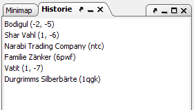

# Bookmarks

The bookmark dock displays all bookmarks.

You can press Ctrl+F2 to add a bookmark for the currently selected object (unit, region, ship, building, island). If there is already such a bookmark, it is removed instead. By pressing F2 or Shift-F2 , respectively, you can jump forward or backwards in the list of bookmarks. The [bookmark menu](../menus/bookmarks/index.html) provides commands to save your bookmarks to a file or load them from it.
