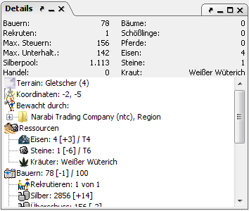

# Details

The details window is probably the most important source of information in Magellan. The details of the currently selected objects are shown here.

The most important information about the region the object is in is shown at the top. This includes: Number of peasants, maximum number of recruits, income of the peasants (possible tax), entertainment limit, pool silver (the silver of all factions with a password entered), trade volume, available trees, horses and iron/laen. The information in the lower part differs depending on the selected object and is shown in a tree, so that information can easily be called upon or hidden at will.

Depending on the kind of object currently selected, the details window shows different information.

**Island:** No information.

**Region:** All information about a region, like the guarding factions, are compared to previous reports', which makes it possible to show the changes since the last report as well. Right-clicking in the details shows a context menu which allows you to write comments on the region (ownership, etc.) These comments can later be changed, removed or expanded on with another right-click.

**Faction:** A summary of all known information on this faction in the region, divided in categories weapons, armor, resources, luxury goods, herbs, potions, miscellaneous and skills. The options of adding comments by right-clicking also exists for factions.

**Ships:** Load (as known), ownership and captain, as well as the units that are on board. Ships can also be commented on by right-clicking.

**Buildings:** Owner, size, inmates as well as required upkeep. The comment function is also available here.

**Streets:** Direction and status of construction.

**Unit:** Here all information on the currently selected unit is shown. This includes load, free capacity when moving, items and skill level. Teacher and student units are also shown. Values in parentheses show the number of items/persons in the next round. If it is impossible to calculate this value a question mark is shown. If the unit is teaching other units, the students' orders can be confirmed with a right-click on the teacher node.

If the unit as a mage the known spells are listed. With a click on a spell you can see its description, if this is saved within the CR. If this is not the case, these can be requested from the server with the SHOW ALL SPELLS command. In the next turn they will be available. Using **_Back_** you return to the unit.

All of the units shown in the details window (teachers, students, inmates) can be selected with a mouse click, which makes it relatively simple to jump e.g. from a student to the corresponding teacher unit.
