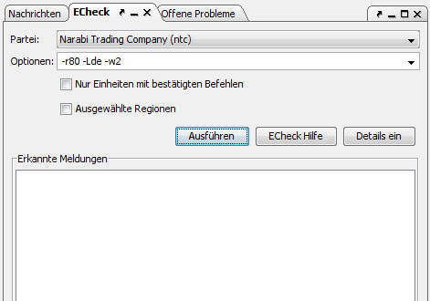

# ECheck

From here you can run ECheck, the Eressea order checker. You can usually reach this dialog by pressing Ctrl+E . You can probably find the most recent information on ECheck on the [Eressea Wiki](https://wiki.eressea.de/index.php/ECheck). A manual can be found there, as well.

Clicking on the menu entry shows the following dialog:

At the top one can enter the path to ECheck. Additional options can be entered directly. The list of possible options can be found in ECheck's documentation.

When you click on **_Run_** the orders are checked. The resulting warnings and errors are shown in the window. By clicking on an error or warning you can jump to the corresponding unit so you can have another look at the orders.

Should you experience funny symbols or messages like "Unknown order: N?CHSTER", there is likely a problem with text encoding. You can adjust the according setting in the [Options](../menus/extras/options_system.html#Textkodierung).
