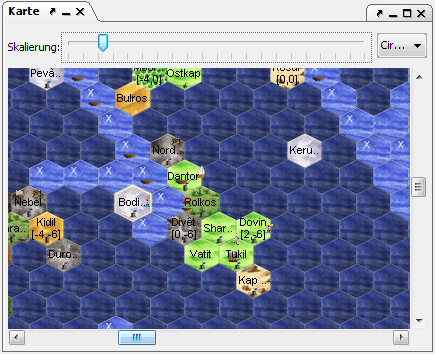

# Karte

Here the map of the known world is displayed.

When "Fog of War" (FOW) is enabled, regions that do not contain units or have not been traveled through, as well as ocean regions that can not be glimpsed from atop a lighthouse, are displayed darker. This mode can be toggled with shortcut key Ctrl+W .

If you click on the map the selected region is opened in the region view. By holding down the mouse button you can pan the map.

Above the map there is a zoom bar that controls the magnification of the map. Additionally you might find two drop-down menus here. One for planes, if you happen to have units in several planes, and one that allows you to choose so-called hotspots. You can add a hotspot by pressing Ctrl+H and entering a name. By doing this you save the current map position and can go back to it at any time through the drop-down menu. If you are at an existing hotspot, you can delete it by pressing Ctrl+ALT+H .

You can select a region with Ctrl+right click , or several with the mouse button held down. This way you can for example select regions to export as a CR. To deselect, use Ctrl+right click again. You may also select the current region by pressing the space bar.

Right clicking a region results in a context menu that has the following options:

* **Change selection state**  
    Allows you to select and deselect the current region as with Ctrl+right click.
* **Copy name and coordinates**  
    Copies the name and coordinates to the clipboard.
* **Set origin to this region**  
    Sets the origin of the coordinate system to the current region. This only applies to the display, a matching ORIGIN order is not issued to any unit.
* **Set or delete hotspot**  
    Sets or deletes a hotspot corresponding to the current region. The name of the hotspot is set to the region's name.
* **Signs**  
    You may add signs to a region on the map. Signs are displayed on the map and may help you to remember important information.
* **Tooltips and Renderer** You can select which tooltip is displayed while hovering over a map region. You can also select how regions are rendered in the map. You can find more information on map renderers in the section about[map options](../menus/extras/options_map.html). You may also choose between available tooltips, texts, and region renderers quickly by pressing Alt+Shift+P, Alt+Shift+A , and Alt+Shift+R, respectively.
