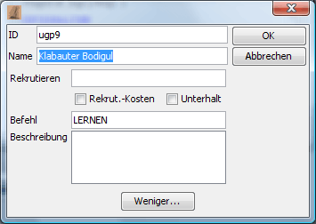

# Orders

This window is used to give units new orders.

If a unit is selected, this unit's orders are shown here and can be edited. Magellan only shows orders for units that belong to a faction that has a password set. Therefore, if no orders are shown, you should enter a password for your faction under [Faction statistics](../menus/extras/factionstatistics.html).

Order-editing is supported by a handy order-completion, which can be adjusted to your [preference](../menus/extras/options_detail.html). To enter an order you only need to type its first letter. Using the cursor keys or CTRL-up / CTRL-down you can select the desired order from the displayed list of suggestions and enter it with the TAB-key. You can configure the order-completion under [Extras/Options/Details](../menus/extras/options_detail.html).

With **_Orders confirmed_** (Ctrl+B) you can confirm the orders of the active unit. The unit will then no longer be shown bold in the region window. Through this functions you can mark the units that you have already edited.

## TEMP-units

Magellan offers an easy way to work with TEMP-units. These are shown as regular units under the units that created them. Transactions of men and items, as well as skills and weights are shown in the details window, the same as for normal units. The necessary orders to create a TEMP-unit (MAKE TEMP \[...\] END) are created by Magellan when the orders are exported. Within Magellan TEMP-units are treated the same as any other unit.

### Creating TEMP-units (CTRL+T)

With a click on this button you can create a TEMP-unit. In the resulting dialog you can enter the unit's name and TEMP-ID. The corresponding orders are created automatically.

Clicking on _More..._ results in the following dialog:

Here you can enter the number of men to be recruited, an order and the unit's description.

### Deleting TEMP-units (Ctrl+Shift+T)

By clicking this button you can delete the current TEMP-unit.
