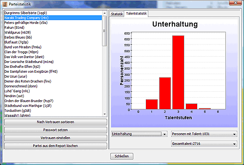

# Faction statistics

The faction statistics provide an overview of the factions in the report. If you select one or more regions beforehand, the statistics are only displayed for these regions.

With the button **_Password and other properties_** you can enter a password for the selected faction. You can only write and export commands for this faction once a password has been set. You can also set **Report owner** and **Coordinate translations** here.

The **_Set trust_** button can be used to set the trust level for the selected faction(s). This is used, for example, for the display of political maps (see [Map settings](options_map.md)) and for sorting the factions in the [Region overview](../../docks/regions.md). If nothing is entered here, Magellan calculates the confidence levels itself using the HELFE states that are set for this faction.

With the button **_Delete faction from report_** you can completely remove a faction from the report, provided that no units of this faction appear in the report in the current turn and there are no other relationships (e.g. alliances) to this faction. This function is used to remove "faction oaks" that were previously encountered but no longer appear in the current report.

## Statistics

If one or more factions are selected in the left-hand window, a statistical list of all goods and units that can currently be seen from this/these faction(s) appears in the right-hand window. In the case of your own faction, this is of course the complete inventory.

For all items, the unit that owns them is indicated. If you click on a unit, it is displayed in the main window and you can issue commands for this unit directly.

## Talent statistics

Here you can see how many people have a particular skill and at what level. To do this, simply select the desired skill from the drop-down menu at the bottom left. The other drop-down menus are for information purposes only, you cannot set anything here. They show the number of people with the talent, the total learning days and the total talent points.
