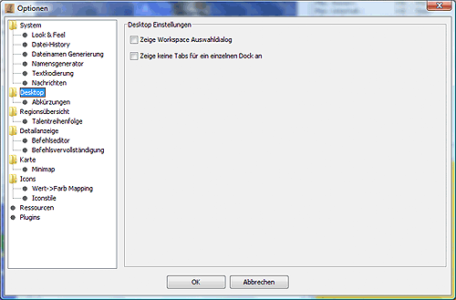
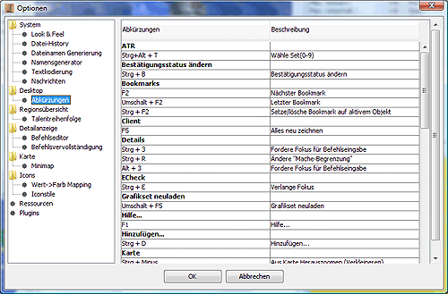

# Desktop

Here you can set the desktop mode of Magellan.

* **Desktop settings**
    Here you can specify whether the [Tabs](../desktop/hidetabs.md) should be displayed or not.  
    The function Show workspace selection dialogue cannot be used actively at the moment.

## Shortcuts

All shortcuts used within Magellan are displayed here. Double-click on the desired option/key combination to open a window in which the new key combination can be entered.
