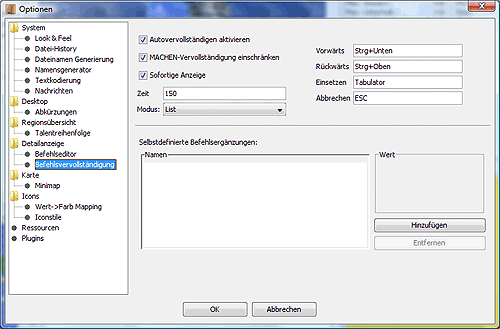

# Detail display

The options for the detailed display and the command supplement can be configured in this dialogue:

## Data display

**Show tag buttons**
    If this option is activated, two buttons for adding and removing additional CR tags are displayed in the detailed display, which can then be analysed using a template, for example.
**Allow own icons**
    This allows you to assign your own icons to your own units and factions. These icons must be stored in the `etc/images/icons/custom` subdirectory.  

* For factions, a GIF file must be stored as follows: `etc/images/icons/custom/factions/<faction number>.gif`.
* For units, a GIF file must be stored as follows: `etc/images/icons/custom/units/<unitnumber>.gif`
**Region short info**
    This field can be used to define the region content that is permanently displayed in the grey area above the detailed display. This text uses the same replacement system as the ATR. Here is [a more detailed description of the replacement system](../../reference/atr_arr.md).

## Command editor

**Multi-Editor Layout**
    If this option is activated, the orders of all units in the region are displayed one below the other in the order window.  
    If the multi-editor layout is deactivated, only the commands of the currently selected unit are displayed in the command window.

* Hide buttons**
    If you select this function, the TEMP buttons are not displayed at the bottom and you gain some space.
**All factions editable**
    Normally, only commands from factions that are _privileged_ can be seen and edited. Normally, this is the faction whose password is known and for which commands are created.  
    For special constellations, it may be desirable to view and edit the commands of other factions as well, for example to simulate a planned transfer and check the resulting weight. This function must be activated to display and change the commands of non-privileged files.
* Colours
    The background of the command box can be coloured differently for the active unit than for the other units. To do this, simply click on the respective colour field.
* **Syntax highlighting**
    Here you can activate syntax highlighting (syntax-dependent colouring of commands) and set the colours.
** **Editor list**
    The settings influence the number of units displayed in the command list. The number of units displayed can be limited to islands, regions and factions.

### Command completion

Automatic command completion makes it easier to enter commands for the units. Depending on the context, useful or possible commands are suggested and can be selected with just a few keystrokes or clicks.

Example:
You type a "G". All commands beginning with "G" are now displayed for selection. After selecting the command "GIB", a list of all units in the region is displayed. Once the unit number has been entered, a list of all items that the unit has appears.

* Activate autocomplete:**
    Here you can activate and deactivate the automatic command completion.
* **Restrict command completion:**
    If this option is selected, only items for which the necessary resources are available are suggested for the MAKE command.
* **Immediate display:**
    Activates the immediate display of command suggestions after entering a command. This means that the next partial command is suggested before the beginning of the word has been typed. If this option is deactivated, at least 1 character must be typed before the command suggestion.
**Time:**
    In the _Time_ field, you can set the delay for displaying the command suggestion in milliseconds.
* Mode:**
    Two modes are available for auto-completion:
  * List
        As soon as one or more characters have been entered, a list of possible additions appears. Each further entry of characters further restricts the selection.  
        Example:
        L -> "TEACH, LEARN, DELIVER"
        LE -> "TEACH, LEARN"
        LEH -> "TEACH"
        You can scroll up and down the list using the cursor keys. Pressing the TAB key or double-clicking on the entry completes the command.  

  * Selected text
        Instead of the selection list, the word is completed up to the next distinction option. The inserted text is highlighted and is overwritten when you continue typing. The suggestion is also accepted here with the TAB key.  

  * No display
        Switches off the display of suggestions. It is still possible to insert (invisible) suggestions.
* In the input fields for **Forward, Backward, Insert** and **Cancel**, you can set the key combinations for the respective functions. **Forward** jumps forward one suggestion, **Backward** jumps back one suggestion, **Insert** inserts the current suggestion and **Cancel** cancels the entry.  

**Self-defined command additions**
    In the lower area of the window, you have the option of defining your own abbreviations, which are then displayed before the normal commands in the command supplements. For example, if you have defined the abbreviation _lh_ for _learn slashing weapons_, this is displayed as follows, similar to the example above:
    L -> "lh, TEACH, LEARN, DELIVER"
    LE -> "TEACH, LEARN"
    If the abbreviation is selected during command creation, the defined text module is used instead of the abbreviation. This module can also be longer than one line.  
    On the left-hand side of the display is a list of the abbreviations defined so far. If you select one of the abbreviations with the mouse, the corresponding text module is displayed on the right-hand side of the screen. The _**Add**_ button can be used to define new abbreviations, while the _**Remove**_ button deletes the currently selected abbreviation from the list.
