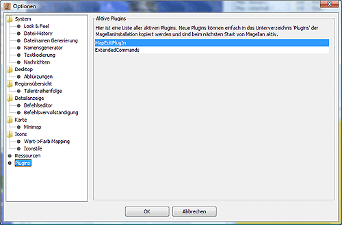

# Plugins

Here you can see which plugins Magellan has recognised and started.

In the current installation version, these are only two plugins.

* MapEditPlugin](../../reference/plugins_mapedit.md)
    for editing the map (adding, removing regions)
* Extended Commands](../../reference/plugins_extcmds.md)
    for script-based creation of commands (similar to template)
