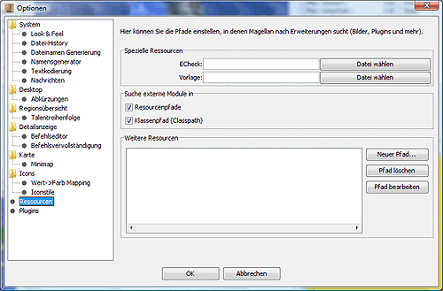

# Resources

In this dialogue you can integrate external files into Magellan. These include, for example, alternative graphics sets, external plugins, customisations for other games (e.g. Verdanon) etc.

Here you can set the paths/directories in which the additional programmes Template, for creating move templates, and ECheck, the syntax checker for Eressea, are located.

Clicking on the button opens a file selection dialogue in which the executable files of the respective programs can be selected.

The dialogue allows you to create, edit and delete resource paths. For most resources, it is sufficient to select the corresponding .jar or .zip file in the file selection box. More detailed information can be found in the documentation of the respective extension and in the chapter [Resources](../../reference/resources.md).
