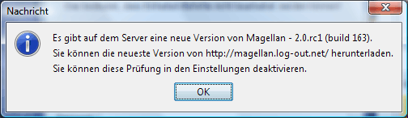

# System

Some global system settings can be set here.

**Language settings**
    Here you can set the language used for the Magellan interface and the commands. For technical reasons, the change will only take effect after a restart of Magellan.

* Temp units**
    Here you can define the behaviour of Magellan when creating temp units. If a value is entered in the **_Start value_** field, Magellan numbers all the temp units created starting with this number, either decimally or in the Base36 system, depending on the setting selected next to the box. This is useful, for example, in an alliance in which each player has been assigned a reserved number range for temp units so that temp units with the same numbers are not created in the same region.  
    If the **Display dialogue when creating temp units** option is selected, an additional window is displayed when temp units are created in which some settings can be made.
* Check for newer version at start **.
    If this option is selected, Magellan checks at startup whether a new version of Magellan is available for download. This requires a connection to the Internet. If a new version is available, the following dialogue is displayed at startup:

    

    [https://magellan2.github.io](https://magellan2.github.io) is the current developer website.
**Load the last report at startup**
    This controls whether the last loaded report is loaded in Magellan when Magellan is started.
* **Display regions "Empty" where regions are missing**
    If this option is set, unknown regions are marked with a question mark.
**Progress indicator**
    If this option is activated, the percentage progress is displayed in the title area of the Magellan window, i.e. the number of units already confirmed.

## Look & Feel

**Look & Feel:**

* Here you can select the look & feel of the Magellan interface. A number of look & feels are already available here by default.

  * CDE/Motif
  * Plastic
  * Liquird LnF
  * Metal
  * Metouia (sf)
  * PGs LnF
  * Plastic (JGoodies)
  * Plastic 3D (JGoodies)
  * Plastic XP (JGoodies)
  * SH Farr
  * Squereness
  * Tiny LnF
  * Windows
  * Windows XP

    Magellan can also be customised with so-called skins. This requires so-called theme packs, which must be placed in the 'skins' subdirectory. (For example, if magellan.jar is in the directory C:\\magellan\\, then skinlf.jar must also be placed in the directory C:\\magellan\\ and the theme pack whistlertheme.zip in the directory C:\\magellan\\skins\\). Suitable theme packs can be found at [www.mylookandfeel.com](http://mylookandfeel.l2fprod.com/portal.php3?action=plaf&id=skinlf).
**Font size**
    Here you can set the relative size of the system font. For technical reasons, the change will only take effect after a restart of Magellan.
* **Display handles at top tree level**
    This means that you can still see the topmost tree node (e.g. in the [Region overview](../../docks/regions.md)) and thus collapse the tree completely. If this node is not displayed, the nodes of the top level must be expanded by double-clicking.

## File history

The value entered here determines how many recently loaded reports appear in the file menu.

## File name generation

If you enter something here, a file name is suggested in the [dialogue for saving the commands](../file/saveorders.md). An example would be {round}-{factionnr}-new.txt .

## Name generator

If you activate this option and include a text file in which names are listed line by line, you can select these when creating new units.

## Text coding

Here you can define how Magellan encodes the reports and commands. There are basically three types of coding.

* System - is the encoding of the system and today usually corresponds to UTF-8.
* ISO-8859-1 - is the standard format for most files in Central Europe
* UTF-8 - is the future.

We highly recommend encoding all reports and commands in UTF-8. The Eressea server now supports this throughout. Only a few tools have a problem with this.

## Messages

**Line break**
    If you activate the option _Activate line break_, the messages that are too long for the width of the message window are wrapped. This means that there is no horizontal scroll bar.

* Colours
    Here you can define different background colours for the different message types to attract attention. The default background colour is white.
