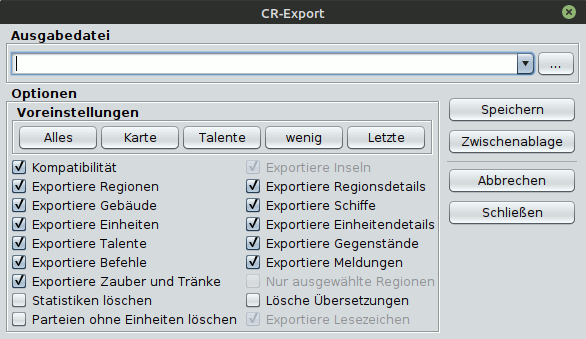

# Export CR

The following options are available for exporting a CR:

* **Save**:
    Saves the command file to the specified location.
**Clipboard**:
    Copies the command file to the clipboard. From there it can easily be copied into a mail programme, for example.
**Close**:
    Closes the dialogue.

## Export options

An AND link applies to all conditions (whereby compatibility must be negated), so if islands are "on" and compatibility is "on", no islands are exported.

| a                                                                                                                                                                           | b                          | c            |
|-----------------------------------------------------------------------------------------------------------------------------------------------------------------------------|----------------------------|--------------|
| **Building**                                                                                                                                                                | **on**                     | **off**      |
| building                                                                                                                                                                    | x                          | \-           |
| salary                                                                                                                                                                      | actual amount              | 10 silver    |
|                                                                                                                                                                             |                            |              |
| **islands**                                                                                                                                                                 | **on**                     | **off**      |
| island blocks and island tags                                                                                                                                               | x                          | \-           |
|                                                                                                                                                                             |                            |              |
| **messages**                                                                                                                                                                | **on**                     | **off**      |
| Faction news                                                                                                                                                                | x                          | \-           |
| fights                                                                                                                                                                      | x                          | \-           |
| Comments                                                                                                                                                                    | x                          | \-           |
| Effects                                                                                                                                                                     | x                          | \-           |
| Region events (deprecated)                                                                                                                                                  | x                          | \-           |
| Region messages (obsolete)                                                                                                                                                  | x                          | \-           |
| Unit messages (obsolete)                                                                                                                                                    | x                          | \-           |
| Environment (obsolete)                                                                                                                                                      | x                          | \-           |
| Transit (deprecated)                                                                                                                                                        | x                          | \-           |
| message types                                                                                                                                                               | x                          | \-           |
| -                                                                                                                                                                           |                            |              |
| **Region details**                                                                                                                                                          | **on**                     | **off**      |
| Farmers, horses, trees, mallorn, silver, upkeep, recruits, wages, iron, laen, herbs, effects, comments, region events, region messages, unit messages, environment, transit | x                          | \-           |
| Borders (roads)                                                                                                                                                             | x                          | \-           |
| -------------------------------------------------------------                                                                                                               | -------------------------- | ------------ |
| **regions**                                                                                                                                                                 | **on**                     | **off**      |
|                                                                                                                                                                             | obvious, no side effects   |              |
|                                                                                                                                                                             |                            |              |
| **ships**                                                                                                                                                                   | **on**                     | **off**      |
|                                                                                                                                                                             | obvious, no side effects   |              |
|                                                                                                                                                                             |                            |              |
| **spells and potions**                                                                                                                                                      | **on**                     | **off**      |
| Spell and potion blocks                                                                                                                                                     | x                          | \-           |
| The spells that a unit can cast are exported in both cases.                                                                                                                 |                            |              |
| -                                                                                                                                                                           |                            |              |
| **Units**                                                                                                                                                                   | **on**                     | **off**      |
| factions and units                                                                                                                                                          | x                          | \-           |
|                                                                                                                                                                             | -                          | -            |
| **Compatibility**                                                                                                                                                           | **on**                     | **off**      |
| configuration tag                                                                                                                                                           | standard                   | Java tools   |
| trustlevel tag                                                                                                                                                              | \-                         | x            |
| comments                                                                                                                                                                    | \-                         | x            |
| ejcOrdersConfirmed tag                                                                                                                                                      | \-                         | x            |
| island tag                                                                                                                                                                  | \-                         | x            |
| island blocks                                                                                                                                                               | \-                         | x            |
| Herb Day (regional herbs)                                                                                                                                                   | \-                         | x            |
| Hot spots                                                                                                                                                                   | \-                         | x            |

The **_Selected regions_** button is only active if regions have been selected in the map by right-clicking. If it is activated, only the selected regions are exported.
