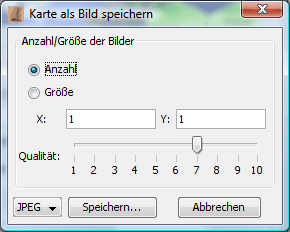

# Save as image

This function can be used to save the map as an image. The current display mode and zoom level are adopted. You can adjust the image export in the following dialogue:

Here you can set the number of files in x/y direction or the size of the image in pixels. By selecting the JPEG or PNG format, Magellan creates the files in the specified format. If PNG is selected, the quality specification is ignored. After clicking on "Save", you can specify the file name in a file selection box.

**Attention:**
With very large maps, this function can consume an enormous amount of memory (several 100MB). In this case, you should create smaller maps by specifying a maximum size per file.
