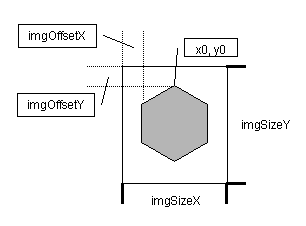

# Create graphic sets

This feature has not been tested for a long time. If you use it successfully, have alternative graphic sets, or have ideas on how to use it, please share your experiences with the development team.

Why yet another new graphics set format?_ This is precisely the question that arose when designing the new map module; the result is not actually another graphics set format, because the concept presented here allows adaptation to any format as long as the necessary information about the cell geometry is available. This means, for example, that existing graphics sets from other clients can also be adopted unchanged if the graphics are in GIF or PNG format. All you have to do is create a suitable cellgeometry.txt file that contains the geometry information about the existing graphics set.

## Resource paths

The [resources page](resources.md) contains basic information on resources and resource paths.

Magellan always loads files (e.g. graphics) from specific directories that indicate the purpose of the file. For the graphics files for the map this is 'images/map/', a graphics set therefore always consists of a directory or an archive (ZIP or JAR file) containing the map graphics in these subdirectories.

A resource path is a reference to such a resource source, e.g. when loading the file Ebene.png, the resource path, the directory 'images/map' and the file name 'Ebene.png' are simply appended together to access the file, e.g. 'C:\\Grafiksets\\images\\map\\Ebene.gif" if "C:\\Grafiksets" is set as the resource path. When accessing, all resource paths are first searched and then, if they could not be found in any resource path, the standard graphics in the Magellan Jar file are accessed.

A graphics set can also be passed on to others as an archive (ZIP or JAR file) to simplify handling. All you have to do is pack the set, i.e. the graphics files and cellgeometry.txt, into a ZIP file or JAR file. However, the files must always be located within this archive in an 'images/map/' subdirectory. Then every Magellan user can use the graphics set by entering this archive as a resource path in the Magellan options dialogue.

## File names

The names of the files used by the existing renderers to display certain objects are listed here. The extension ".png", ".gif" and/or "-alpha.gif" must be appended to the full name that the file must actually have.

The file names must all be in lower case, otherwise Magellan will not be able to access them!

* Regions: All region names without umlauts (e.g. "wueste"), additionally "nebel" for the Fog-of-War
* Borders: "strasse0" (NW) to "strasse5" (SW, clockwise) and "strasse\_incomplete0" (NW) to "strasse\_incomplete5" (SW, clockwise). If there are no graphics for incomplete streets, the graphics for completed streets are used.
* Buildings: All building names without umlauts (e.g. "saegewerk")
* Ships: "schiff0" (no coast), "schiff1" (NW) to "schiff6" (SW, clockwise)
* Direction indicators: "arrow0" (NW) to "arrow5" (SW, clockwise)
* Selection markers: "active", "selected"

All files should be stored together with the file cellgeometry.txt (see 'Cell geometry') in a common directory 'images/map/'.

## File format

The graphic files may be in PNG or GIF format; alpha channels and transparency are used in different ways:

PNG: If a file with the extension .png is found, it is used and the alpha channel information it contains is used directly. PNG files have the advantage that they allow 24-bit colour depth and an integrated 8-bit alpha channel. Unfortunately, Java 1.2 does not yet support PNG graphics, so only users with a JRE >= 1.3 can use such graphic sets.

GIF + alpha channel: If no file with the extension ".png" is found, the renderer searches for a file with the extension ".gif", which contains the RGB information of the image and a file with the extension "-alpha.gif", which is interpreted as a greyscale image and used as the alpha channel for the other GIF.

GIF: If there is no file with the extension "-alpha.gif", but there is a standard GIF file, the RGB and transparency information it contains is used.

## Size of the graphics / cell geometry

In principle, the size of the graphics is arbitrary, but must be the same for all images within a graphics set. The client also requires information about the geometry of the region hexagon, i.e. its corner coordinates, as well as its position in the graphic and the total size of the graphic. This then looks something like this:

x0=32 <- x-coordinate of the corner point at 12 o'clock
x1=63 <- x-coordinate of the corner point at 2 o'clock
x2=63
x3=32
x4=0 <- x-coordinate of the corner point at 8 o'clock (hexagon coordinates, i.e. always 0!)
x5=0 <- x-coordinate of the corner point at 10 o'clock (hexagon coordinates, i.e. always 0!)
y0=0 <- y-coordinate of the corner point at 12 o'clock (hexagon coordinates, i.e. always 0!)
y1=16 <- y-coordinate of the corner point at 2 o'clock
y2=47
y3=63
y4=47
y5=16
imgOffsetx=8 <- distance between left hexagon edge and graphic edge
imgOffsety=8 <- Distance between upper hexagon border and graphic border
imgSizex=80 <- Width of the graphic file
imgSizey=80 <- Height of the graphic file

All values are in pixels. If the width and height of the region hexagon correspond to those of the graphics file, there will be no overlaps when drawing the individual graphics. However, if the graphic size is larger than that of the region hexagon, there will be overlaps when drawing the graphics, depending on the value imgOffsetx/y above, below, left or right of the region hexagon. Together with the utilisation of transparency information in the graphics, all kinds of effects can be created, e.g. barely noticeable transitions between regions. It should be noted that the regions are drawn line by line from top left to bottom right on all rendering layers.

The file with this information must be called "cellgeometry.txt" and be located in the same directory (images/map/) as the graphics. The content of this file may seem somewhat obscure, but its meaning should quickly become clear if you look at its content in existing graphics sets.

## Renderer

Magellan supports different 'renderers' for each sub-layer of the map, i.e. sub-modules that bring the graphics files to the screen. They are arranged in several layers in order to have a fixed order for rendering, which is reflected in the depth arrangement of the drawn graphics. The order is currently:

1. regions
2. borders (roads)
3. buildings
4. ships
5. region names
6. direction arrows
7. selection markers

This means that earlier layers are covered by later layers. At the moment there is only one standard renderer for each of the layers, but these should be flexible enough for most purposes.

When designing the graphics and defining any overlaps between the graphics, it should be noted that the regions are drawn line by line from top left to bottom right on all rendering layers.

It is also very easy to programme new renderers, e.g. to display additional objects on the map or certain region properties.
