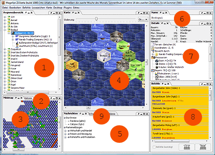

# Docks

Magellan affiche toutes les informations dans plusieurs fenêtres appelées docks.

1. [Vue d'ensemble des régions](regions.html)
2. [Histoire](histoire.html)
3. [MiniCarte](mini-carte.html)
4. [Carte](carte.html)
5. [Messages](messages.html)
6. [Nom et description](nom.html)
7. [Détails](details.html)
8. [Commandes](commandes.html)
9. [ECheck](echeck.html) & [Tâches en cours](problems.html)
10. [Signets](signets.html) (pas dans l'image)
