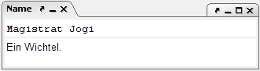

# Nom/Description

Cette fenêtre affiche le nom et la description de l'objet actif, c'est-à-dire des îles, des régions, des bâtiments, des navires, des unités et des factions. Les noms et les descriptions peuvent être modifiés, et les changements sont automatiquement saisis sous forme d'ordres NAME ou DESCRIBE pour l'unité correspondante. Si le nom ou la description d'un bâtiment ou d'un navire est modifié, ces ordres sont ajoutés à son propriétaire. Pour les noms et les descriptions de régions, les ordres vont au propriétaire du plus grand château, etc.
