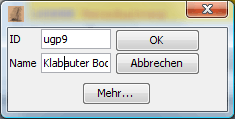

# Commandes

Cette fenêtre est utilisée pour donner de nouveaux ordres aux unités.

Si une unité est sélectionnée, les ordres de cette unité sont affichés ici et peuvent être modifiés. Magellan n'affiche que les ordres des unités qui appartiennent à une faction dont le mot de passe est défini. Par conséquent, si aucun ordre n'est affiché, vous devez entrer un mot de passe pour votre faction dans [Faction statistics](../menus/extras/factionstatistics.html).

L'édition des ordres est assistée par un formulaire d'ordre pratique, qui peut être ajusté selon vos [préférences](../menus/extras/options_detail.html). Pour saisir une commande, il suffit de taper sa première lettre. À l'aide des touches du curseur ou des touches CTRL haut / CTRL bas, vous pouvez sélectionner la commande souhaitée dans la liste de suggestions affichée et la saisir à l'aide de la touche TAB. Vous pouvez configurer l'exécution des commandes sous [Extras/Options/Détails](../menus/extras/options_detail.html).

Avec **_Ordres confirmés_** (Ctrl+B) vous pouvez confirmer les ordres de l'unité active. L'unité ne sera alors plus affichée en gras dans la fenêtre de la région. Cette fonction vous permet de marquer les unités que vous avez déjà modifiées.

## Unités TEMP

Magellan offre un moyen facile de travailler avec les unités TEMP. Celles-ci sont affichées comme des unités régulières sous les unités qui les ont créées. Les transactions d'hommes et d'articles, ainsi que les compétences et les poids sont affichés dans la fenêtre de détails, de la même manière que pour les unités normales. Les ordres nécessaires à la création d'une unité TEMP (MAKE TEMP \[...\] END) sont créés par Magellan lorsque les ordres sont exportés. Dans Magellan, les unités TEMP sont traitées de la même manière que n'importe quelle autre unité.

### Création d'unités TEMP (CTRL+T)

En cliquant sur ce bouton, vous pouvez créer une unité TEMP. Dans la boîte de dialogue qui s'ouvre, vous pouvez saisir le nom de l'unité et l'ID TEMP. Les commandes correspondantes sont créées automatiquement.

En cliquant sur _Plus..._, vous obtenez la boîte de dialogue suivante :

Vous pouvez y entrer le nombre d'hommes à recruter, un ordre et la description de l'unité.

### Suppression des unités TEMP (Ctrl+Shift+T)

En cliquant sur ce bouton, vous pouvez supprimer l'unité TEMP en cours.
