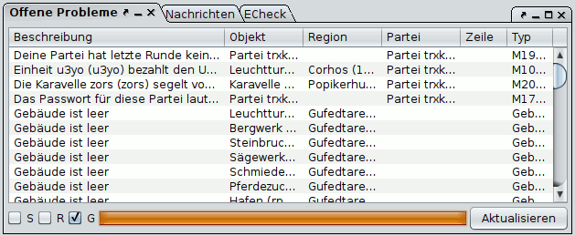

# Tâches ouvertes

Dans cette liste, Magellan affiche tous les problèmes qu'il a reconnus. Cette liste peut être utilisée comme point de départ pour les commandes qui doivent encore être éditées. Veuillez noter que Magellan n'est pas en mesure de trouver et de signaler tous les problèmes qui peuvent survenir. Néanmoins, il s'agit d'un outil puissant qui rend d'autres outils comme ECheck redondants.

Vous pouvez trier les problèmes en cliquant sur les titres des colonnes. Si vous appuyez sur la touche Ctrl et que vous cliquez ensuite sur un autre titre, vous pouvez effectuer un tri sur plusieurs colonnes.

D'autres options de configuration des problèmes affichés sont disponibles en bas de page :

**S** Afficher uniquement les problèmes des régions marquées sur la carte. Si aucune région n'est marquée, cette option n'a aucun effet.
**R** Afficher uniquement les problèmes de la région active.
**G** Affiche également les problèmes globaux, qui n'appartiennent pas à une région particulière.
**Refresh** Il peut arriver que les problèmes ne soient pas calculés complètement. Vous pouvez relancer le calcul à l'aide de ce bouton.

En double-cliquant sur une ligne, vous pouvez passer à l'unité ou à la région concernée, le cas échéant.

Vous pouvez configurer davantage les problèmes à l'aide du menu contextuel (clic droit sur une ligne) :

**Afficher le texte intégral** (également en appuyant sur CTRL et en double-cliquant sur une ligne) : Affiche le texte complet, qui ne tient pas toujours dans la colonne du tableau.

* **Sélectionner l'objet** Identique au double clic
* **Refresh** Identique au bouton
**Supprimer le problème** Cette option permet de masquer ce problème concret dans le rapport. Cela ajoute généralement un commentaire spécial à l'unité concernée.
**Afficher les problèmes cachés** Affiche à nouveau tous les problèmes cachés et supprime les commentaires ajoutés.
* Ignorer de façon permanente les problèmes similaires** Cette option permet de supprimer tous les problèmes d'un certain type dans les rapports futurs. Cela vous permet de masquer certains problèmes et de vous concentrer sur les plus importants. Par exemple, vous pouvez masquer tous les avertissements concernant les bâtiments vides.

Il existe deux grands types de problèmes :

* les messages de rapport, par exemple les messages concernant les bâtiments qui n'ont pas été payés
* les messages créés par Magellan, par exemple les avertissements concernant l'absence d'argent pour l'entretien.

Vous pouvez visualiser les types de problèmes supprimés dans la section d'option pour les problèmes ouverts. Vous pouvez également réactiver les types de problèmes supprimés à cet endroit.
