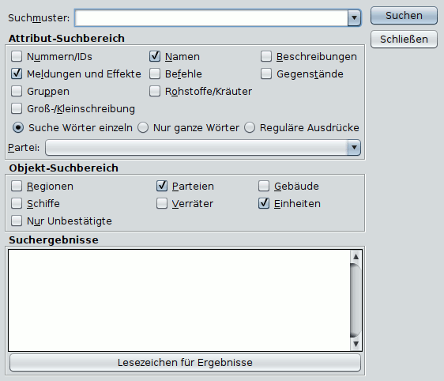

# Recherche

CTRL-F

Cette fonction vous permet de rechercher des mots-clés dans le rapport afin de trouver des unités, des navires, etc. "perdus". Vous pouvez définir l'étendue de la recherche dans la boîte de dialogue suivante. Vous pouvez définir la plage de recherche dans la boîte de dialogue suivante :

Le champ **Modèle_de_recherche** peut également rester vide. La recherche d'un motif de recherche vide et de la zone de recherche "Navires", par exemple, renvoie tous les navires qui apparaissent dans le rapport.

Dans le bloc **_Zone de recherche d'attributs_**, vous pouvez définir les attributs d'un objet qui doivent être pris en compte dans la recherche. Vous pouvez également limiter la recherche à une faction spécifique. L'option "Rechercher les mots individuellement" permet de rechercher tous les objets qui contiennent l'un des mots saisis en tant que partie. L'option "Mots entiers uniquement" permet de rechercher uniquement les objets qui contiennent le motif de recherche dans son ensemble. Les expressions régulières permettent d'effectuer des recherches, par exemple ' `.*bauer`' permet de trouver des agriculteurs, des éleveurs de montagne et des éleveurs d'oiseaux, et ' `^B.*auer$`' permet de trouver des agriculteurs et des éleveurs de montagne, mais pas d'éleveurs d'oiseaux.

Le bloc **_Zone de recherche d'objets_** vous permet de restreindre la recherche aux unités, aux bâtiments, aux navires, aux régions et aux traîtres.

Cliquez sur le résultat de la recherche pour afficher l'objet correspondant dans la fenêtre principale.
