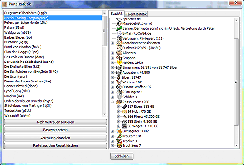

# Statistiques des factions

Les statistiques des factions donnent une vue d'ensemble des factions présentes dans le rapport. Si vous sélectionnez au préalable une ou plusieurs régions, les statistiques ne sont affichées que pour ces régions.

Le bouton **_Mot de passe et autres propriétés_** permet de saisir un mot de passe pour la faction sélectionnée. Vous ne pouvez écrire et exporter des commandes pour cette faction qu'une fois le mot de passe défini. Vous pouvez également définir ici **Propriétaire du rapport** et **Traductions des coordonnées**.

Le bouton **Set trust_** permet de définir le niveau de confiance pour la ou les factions sélectionnées. Ceci est utilisé, par exemple, pour l'affichage des cartes politiques (voir [Map settings](options_map.md)) et pour le tri des factions dans le [Region overview](../../docks/regions.md). Si rien n'est saisi ici, Magellan calcule lui-même les niveaux de confiance en utilisant les états HELFE définis pour cette faction.

Le bouton **_Supprimer la faction du rapport_** permet de supprimer complètement une faction du rapport, à condition qu'aucune unité de cette faction n'apparaisse dans le rapport pendant le tour en cours et qu'il n'y ait pas d'autres relations (par exemple, des alliances) avec cette faction. Cette fonction est utilisée pour supprimer les "chênes de faction" qui ont été rencontrés précédemment mais qui n'apparaissent plus dans le rapport actuel.

## Statistiques

Si une ou plusieurs factions sont sélectionnées dans la fenêtre de gauche, une liste statistique de tous les biens et unités qui peuvent actuellement être vus de cette/ces faction(s) apparaît dans la fenêtre de droite. Dans le cas de votre propre faction, il s'agit bien sûr de l'inventaire complet.

Pour tous les objets, l'unité qui les possède est indiquée. Si vous cliquez sur une unité, elle s'affiche dans la fenêtre principale et vous pouvez lui donner des ordres directement.

## Statistiques sur les talents

Vous pouvez voir ici combien de personnes possèdent une compétence particulière et à quel niveau. Pour cela, il suffit de sélectionner la compétence souhaitée dans le menu déroulant en bas à gauche. Les autres menus déroulants sont fournis à titre d'information uniquement, vous ne pouvez rien y définir. Ils indiquent le nombre de personnes possédant le talent, le nombre total de jours d'apprentissage et le nombre total de points de talent.
