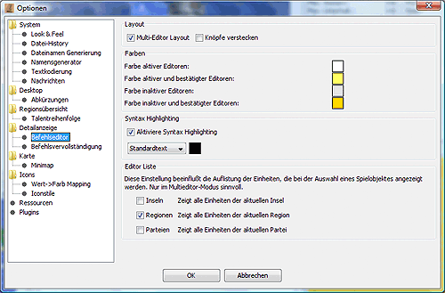

# Affichage détaillé

Les options pour l'affichage détaillé et le supplément de commande peuvent être configurées dans cette boîte de dialogue :

## Affichage des données

**Afficher les boutons de balises**
    Si cette option est activée, deux boutons permettant d'ajouter et de supprimer des balises CR supplémentaires sont affichés dans l'affichage détaillé, qui peut ensuite être analysé à l'aide d'un modèle, par exemple.
**Autoriser ses propres icônes**
    Cette option vous permet d'attribuer vos propres icônes à vos unités et factions. Ces icônes doivent être stockées dans le sous-répertoire `etc/images/icons/custom`.  

* Pour les factions, un fichier GIF doit être stocké comme suit : `etc/images/icons/custom/factions/<numéro de faction>.gif`.
* Pour les unités, un fichier GIF doit être stocké comme suit : `etc/images/icons/custom/factions/<numéro de la faction>.gif` : `etc/images/icons/custom/units/<numéro d'unité>.gif`.
**Info courte sur la région**
    Ce champ peut être utilisé pour définir le contenu de la région qui est affiché en permanence dans la zone grise au-dessus de l'affichage détaillé. Ce texte utilise le même système de remplacement que l'ATR. Voici [une description plus détaillée du système de remplacement](../../reference/atr_arr.md).

## Éditeur de commandes

**Mise en page multi-éditeurs**
    Si cette option est activée, les ordres de toutes les unités de la région sont affichés les uns à la suite des autres dans la fenêtre d'ordre.  
    Si cette option est désactivée, seules les commandes de l'unité sélectionnée sont affichées dans la fenêtre de commande.

* Cacher les boutons**
    Si vous sélectionnez cette fonction, les boutons TEMP ne sont pas affichés en bas et vous gagnez de l'espace.
**Toutes les factions sont modifiables
    Normalement, seules les commandes des factions _privilégiées_ peuvent être vues et modifiées. Normalement, il s'agit de la faction dont le mot de passe est connu et pour laquelle les commandes sont créées.  
    Pour des constellations spéciales, il peut être souhaitable de voir et d'éditer les commandes d'autres factions, par exemple pour simuler un transfert planifié et vérifier le poids qui en résulte. Cette fonction doit être activée pour afficher et modifier les commandes des fichiers non privilégiés.
* Couleurs
    Le fond de la boîte de commande peut être coloré différemment pour l'unité active et pour les autres unités. Pour ce faire, il suffit de cliquer sur le champ de couleur correspondant.
**Mise en évidence de la syntaxe**
    Vous pouvez ici activer la coloration syntaxique (coloration des commandes en fonction de la syntaxe) et définir les couleurs.
**Liste de l'éditeur**
    Les paramètres influencent le nombre d'unités affichées dans la liste des commandes. Le nombre d'unités affichées peut être limité aux îles, aux régions et aux factions.

### Achèvement de la commande

La complétion automatique des commandes facilite la saisie des commandes pour les unités. En fonction du contexte, des commandes utiles ou possibles sont suggérées et peuvent être sélectionnées en quelques frappes ou clics.

Exemple : vous tapez un "G" :
Vous tapez un "G". Toutes les commandes commençant par "G" sont alors affichées et peuvent être sélectionnées. Après avoir sélectionné la commande "GIB", une liste de toutes les unités de la région s'affiche. Une fois le numéro de l'unité saisi, une liste de tous les éléments dont dispose l'unité s'affiche.

* Activer l'autocomplétion:**
    Vous pouvez ici activer et désactiver l'exécution automatique des commandes.
**Restreindre l'exécution de la commande:**
    Si cette option est sélectionnée, seuls les éléments pour lesquels les ressources nécessaires sont disponibles sont proposés pour la commande MAKE.
**Affichage immédiat:**
    Active l'affichage immédiat des suggestions de commande après la saisie d'une commande. Cela signifie que la commande partielle suivante est suggérée avant que le début du mot n'ait été tapé. Si cette option est désactivée, au moins un caractère doit être tapé avant la suggestion de commande.
**Heure:**
    Dans le champ _Time_, vous pouvez définir le délai d'affichage de la suggestion de commande en millisecondes.
* Mode:**
    Deux modes sont disponibles pour l'auto-complétion :
  * Liste
        Dès qu'un ou plusieurs caractères ont été saisis, une liste d'ajouts possibles apparaît. Chaque nouvelle entrée de caractères restreint davantage la sélection.  
        Exemple :
        L -> "ENSEIGNER, APPRENDRE, DÉLIVRER"
        LE -> "ENSEIGNER, APPRENDRE"
        LEH -> "ENSEIGNER"
        Vous pouvez faire défiler la liste vers le haut ou vers le bas à l'aide des touches du curseur. Une pression sur la touche TAB ou un double-clic sur l'entrée complète la commande.  

  * Texte sélectionné
        Au lieu de la liste de sélection, le mot est complété jusqu'à l'option de distinction suivante. Le texte inséré est mis en évidence et est écrasé lorsque vous continuez à taper. La suggestion est également acceptée ici avec la touche TAB.  

  * Pas d'affichage
        Désactive l'affichage des suggestions. Il est toujours possible d'insérer des suggestions (invisibles).
* Dans les champs de saisie pour **Avancer, Reculer, Insérer** et **Annuler**, vous pouvez définir les combinaisons de touches pour les fonctions respectives. **Avancer** permet d'avancer d'une suggestion, Reculer** permet de reculer d'une suggestion, Insérer** permet d'insérer la suggestion en cours et Annuler** permet d'annuler la saisie.  

**Ajouts de commandes auto-définies
    Dans la partie inférieure de la fenêtre, vous avez la possibilité de définir vos propres abréviations, qui s'affichent alors avant les commandes normales dans les suppléments de commande. Par exemple, si vous avez défini l'abréviation _lh_ pour _apprendre les armes tranchantes_, elle s'affiche comme suit, comme dans l'exemple ci-dessus :
    L -> "lh, TEACH, LEARN, DELIVER"
    LE -> "ENSEIGNER, APPRENDRE"
    Si l'abréviation est sélectionnée lors de la création de la commande, l'élément de texte défini est utilisé à la place de l'abréviation. Ce module peut également être plus long qu'une ligne.  
    La liste des abréviations définies jusqu'à présent s'affiche sur le côté gauche de l'écran. Si vous sélectionnez l'une des abréviations avec la souris, l'élément de texte correspondant s'affiche à droite de l'écran. Le bouton _**Add**_ permet de définir de nouvelles abréviations, tandis que le bouton _**Remove**_ supprime de la liste l'abréviation actuellement sélectionnée.
