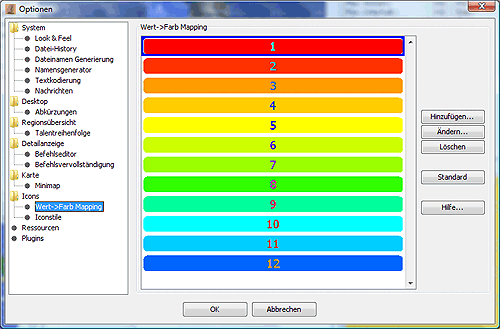

# Icônes

## Paramètres des icônes

**Afficher l'info courte:** Si cette option est activée, vous obtiendrez le talent correspondant ou le nom du bâtiment que l'icône représente si vous passez le pointeur de la souris sur une icône pendant une longue période de temps.

**Messages/Détails/Régions** : Les options relatives à chaque panneau sont résumées dans la zone correspondante.

Selon la zone concernée, diverses sous-options sont disponibles sous forme d'onglets sur le côté gauche. Le réglage fin des sous-options correspondantes s'effectue dans une fenêtre séparée, qui peut être ouverte en appuyant sur le bouton _**Détails**_.

**Onglet Unité
    Cet onglet fait référence à la ligne contenant le nom de l'unité. Outre le nom, d'autres informations peuvent être affichées.
  **Afficher les icônes et les textes supplémentaires**
        Affiche les icônes des talents, des objets et de l'emplacement de l'unité.
  **Afficher les changements de talents**
        si vous avez également chargé un rapport de la semaine précédente, vous pouvez l'utiliser pour afficher les changements de talents.
  **Classer les éléments par catégorie
        Résume les différents objets, par exemple toutes les armes.
**Onglet Talent
    Cet onglet fait référence aux lignes extensibles situées sous le nom de l'unité dans la fenêtre de détail, qui contiennent les différents talents de l'unité.
  **Afficher les informations sur le niveau suivant**
        indique le temps nécessaire pour apprendre le niveau suivant, si le jeu le permet.
  **Afficher les changements de talents**
        si vous avez également chargé un rapport de la semaine précédente, vous pouvez l'utiliser pour afficher les changements de talents.
**Onglet Articles
    Cet onglet fait référence aux lignes extensibles situées sous le nom de l'unité dans la fenêtre de détail, qui répertorient les éléments de l'unité.
**Affichage du nombre de régions**
        affiche le nombre total d'éléments dans la région située derrière les éléments.
**Onglet simple
    Cet onglet renvoie aux autres lignes de la fenêtre de détail.
  **Afficher les icônes**
        affiche une icône au début de la ligne s'il en existe une pour l'information affichée.

## Correspondance valeur->couleur

La couleur de la police pour l'affichage des valeurs de talent dans la fenêtre de la région peut être configurée ici en fonction des valeurs de talent. Si aucune couleur n'est définie ici, le noir est utilisé.

## Style de l'icône

Le type d'affichage dans la fenêtre de la région peut être configuré ici.

**Simple**
    se réfère aux icônes qui n'ont pas de style propre, c'est le réglage par défaut.
**Principale**
    renvoie aux noms des régions et des factions.
**Partie supplémentaire**
    fait référence aux unités.

Les options de paramétrage sont réparties entre les points suivants :

* Position du nom ou de la valeur textuelle par rapport à l'icône
* Polices et tailles de polices différentes des paramètres par défaut
* Couleurs d'arrière-plan et d'avant-plan/police différentes de la norme

En outre, vous pouvez utiliser le bouton _**Add**_ pour définir vos propres styles d'icônes, que vous pouvez ensuite activer avec Template, par exemple. Dans le CR, ils doivent se trouver dans le contexte des unités sous la forme _"Nom du style d'icône";magStyle_. Les styles d'icônes définis par l'utilisateur peuvent être supprimés à nouveau à l'aide du bouton _**Delete**_.

Si les changements de talent sont affichés à l'aide d'une feuille de style, les styles d'icônes nécessaires à cet effet figurent également dans cette liste, sous le nom _Talentx_, où x est le numéro du changement de niveau correspondant.
