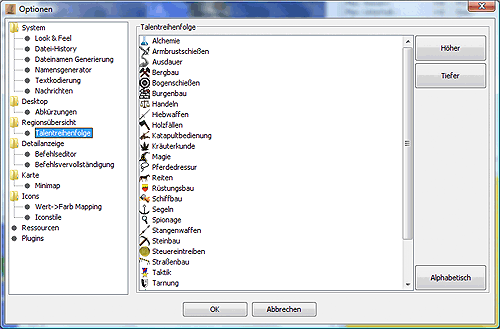

# Vue d'ensemble de la région

Dans cette boîte de dialogue, vous pouvez définir les options pour la [Vue d'ensemble de la région] (.../../docks/regions.md) :

**Tri des régions**
    Vous pouvez ici définir l'affichage des noms de régions en fonction des coordonnées ou de l'appartenance à une île. Si l'option _Affichage des îles_ est également activée, les régions sont précédées d'un "nœud d'ordre" pour l'île, qui peut être développé et réduit.

    Magellan peut diviser les régions d'un rapport en îles et les afficher par île dans la vue d'ensemble de la région. En principe, d'autres utilisations possibles des îles sont également concevables.

    L'élément de menu "[Créer des îles](menu_map_island.md)" dans le menu "Extras" permet d'attribuer des îles aux régions. C'est une condition préalable pour pouvoir trier les régions en fonction des îles.

    Pour trier la vue d'ensemble des régions par île, les paramètres suivants doivent être définis dans cette boîte de dialogue :
    1. Trier les régions_ activé
    2. sélectionner _Par île
    3. L'option _Afficher les îles_ détermine si les îles sont effectivement affichées dans la vue d'ensemble. Les noms et les descriptions des îles ne peuvent être modifiés que si cette option est activée.

* Structure arborescente hiérarchique
    Cette option permet de définir les niveaux d'organisation disponibles dans la vue d'ensemble de la région. Les paramètres par défaut sont Faction et Groupe. Pour ajouter d'autres niveaux, sélectionnez-les dans la boîte de sélection à gauche et cliquez sur la flèche pointant vers la droite. Pour supprimer des niveaux, sélectionnez-les sur la droite et supprimez-les en utilisant la flèche vers la gauche. Vous pouvez également utiliser les boutons "Plus haut" et "Plus bas" pour modifier l'ordre de la hiérarchie.
* Tri des unités
    La sortie des unités peut être triée ici selon l'ordre du rapport (ordre des unités dans le CR), le nom du talent ou le nom de l'unité. Il existe d'autres options de réglage pour le tri par talent. Le réglage par défaut est le tri selon le meilleur talent, c'est-à-dire qu'une unité avec des armes tranchantes T6 et des tactiques T3 est triée avec les autres armes tranchantes, et le tri selon l'alphabet, c'est-à-dire que les bûcherons suivent les armes tranchantes.

    Si vous souhaitez modifier cet ordre, vous pouvez spécifier l'ordre de tri des talents dans la sous-rubrique Ordre des talents et ainsi afficher tous les talents de combat ou de production par blocs, par exemple. Il est également possible d'influencer le tri des unités possédant plusieurs talents en activant l'item _Par talent le plus élevé dans l'ordre des talents_. Si l'item est activé et que Tactique est placé avant Armes tranchantes dans la liste des talents, l'unité avec Armes tranchantes T6 et Tactique T3 sera triée sous Tactique.

**Extension de l'arbre**
    Ces options permettent de déterminer si et jusqu'où l'arbre de la région s'étend lorsqu'une région est activée sur la [Carte] (.../../docks/map.md). Les options de la colonne de droite influencent le comportement d'ouverture et celles de la colonne de gauche influencent le comportement de fermeture des informations régionales précédemment étendues.

## Ordre des talents

L'ordre des talents est modifié en sélectionnant le talent correspondant avec la souris, puis en le déplaçant à l'aide des boutons _Higher_ ou _Lower_.
