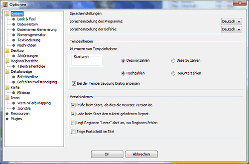
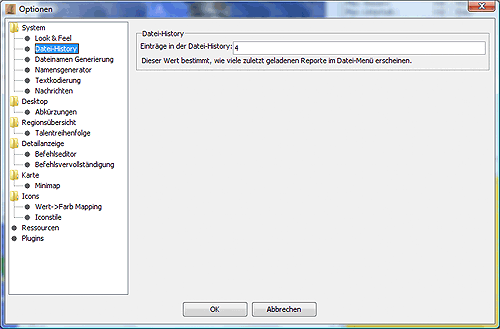
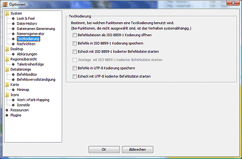

# Système

Certains paramètres globaux du système peuvent être définis ici.

**Réglages de la langue**
    Vous pouvez régler ici la langue utilisée pour l'interface Magellan et les commandes. Pour des raisons techniques, le changement ne sera effectif qu'après un redémarrage de Magellan.

* Unités temp
    Vous pouvez définir ici le comportement de Magellan lors de la création d'unités temporaires. Si une valeur est saisie dans le champ **_Valeur de départ**, Magellan numérote toutes les unités temporaires créées à partir de ce nombre, soit de manière décimale, soit dans le système Base36, en fonction du paramètre sélectionné à côté de la case. Ceci est utile, par exemple, dans une alliance où chaque joueur s'est vu attribuer une plage de numéros réservés pour les unités temporaires, afin que des unités temporaires portant les mêmes numéros ne soient pas créées dans la même région.  
    Si l'option **Afficher le dialogue lors de la création d'unités temporaires** est sélectionnée, une fenêtre supplémentaire s'affiche lors de la création d'unités temporaires, dans laquelle certains réglages peuvent être effectués.
* Vérifier la présence d'une version plus récente au démarrage **.
    Si cette option est sélectionnée, Magellan vérifie au démarrage si une nouvelle version de Magellan est disponible au téléchargement. Cela nécessite une connexion à Internet. Si une nouvelle version est disponible, la boîte de dialogue suivante s'affiche au démarrage :

    

    [https://magellan2.github.io](https://magellan2.github.io) est le site web actuel du développeur.
**Charger le dernier rapport au démarrage**
    Ceci contrôle si le dernier rapport chargé est chargé dans Magellan lorsque Magellan est démarré.
**Afficher les régions "vides" lorsque des régions sont manquantes**
    Si cette option est activée, les régions inconnues sont marquées d'un point d'interrogation.
**Indicateur de progression
    Si cette option est activée, le pourcentage d'avancement est affiché dans la zone de titre de la fenêtre Magellan, c'est-à-dire le nombre d'unités déjà confirmées.

## Look & Feel

**Look & Feel:**

* Vous pouvez ici sélectionner l'aspect et la convivialité de l'interface du Magellan. Un certain nombre d'aspects et de sensations sont déjà disponibles par défaut.

  * CDE/Motif
  * Plastic
  * Liquird LnF
  * Métal
  * Metouia (sf)
  * PGs LnF
  * Plastique (JGoodies)
  * Plastic 3D (JGoodies)
  * Plastic XP (JGoodies)
  * SH Farr
  * Squereness
  * Tiny LnF
  * Windows
  * Windows XP

    Magellan peut également être personnalisé avec des "skins". Pour ce faire, il faut utiliser des packs de thèmes, qui doivent être placés dans le sous-répertoire "skins". (Par exemple, si magellan.jar se trouve dans le répertoire C:\Nmagellan\N, skinlf.jar doit également être placé dans le répertoire C:\Nmagellan\Net le theme pack whistlertheme.zip dans le répertoire C:\Nmagellan\Nskins\N). Des packs de thèmes appropriés sont disponibles à l'adresse [www.mylookandfeel.com](http://mylookandfeel.l2fprod.com/portal.php3?action=plaf&id=skinlf).
**Taille de la police**
    Vous pouvez définir ici la taille relative de la police du système. Pour des raisons techniques, la modification ne prendra effet qu'après un redémarrage de Magellan.
**Afficher les poignées au niveau de l'arbre supérieur**
    Cela signifie que vous pouvez toujours voir le nœud le plus haut de l'arbre (par exemple dans la [Vue d'ensemble de la région](../../docks/regions.md)) et donc réduire complètement l'arbre. Si ce nœud n'est pas affiché, les nœuds du niveau supérieur doivent être développés en double-cliquant.

## Historique du fichier

La valeur saisie ici détermine combien de rapports récemment chargés apparaissent dans le menu des fichiers.

## Génération du nom de fichier

Si vous saisissez quelque chose ici, un nom de fichier est suggéré dans le [dialogue d'enregistrement des commandes] (../file/saveorders.md). Un exemple serait {round}-{factionnr}-new.txt .

## Générateur de nom

Si vous activez cette option et que vous incluez un fichier texte dans lequel les noms sont listés ligne par ligne, vous pouvez les sélectionner lors de la création de nouvelles unités.

## Codage du texte

Vous pouvez définir ici comment Magellan encode les rapports et les commandes. Il existe trois types de codage.

* Système - est le codage du système et correspond généralement à UTF-8.
* ISO-8859-1 - est le format standard pour la plupart des fichiers en Europe centrale.
* UTF-8 - c'est l'avenir.

Nous recommandons vivement d'encoder tous les rapports et commandes en UTF-8. Le serveur Eressea prend désormais en charge ce format dans son ensemble. Seuls quelques outils posent problème.

## Messages

**Saut de ligne**
    Si vous activez l'option _Activer le saut de ligne_, les messages qui sont trop longs pour la largeur de la fenêtre de message sont enveloppés. Cela signifie qu'il n'y a pas de barre de défilement horizontale.

* Couleurs
    Vous pouvez définir ici différentes couleurs d'arrière-plan pour les différents types de messages afin d'attirer l'attention. La couleur d'arrière-plan par défaut est le blanc.
