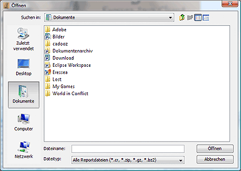

# Ouvrir

CTRL-O

Cet élément est utilisé pour ouvrir les CR (Eressea Computererreports). Après avoir cliqué, la boîte de dialogue suivante apparaît :

Le dialogue est largement explicite et devrait correspondre à un dialogue normal d'ouverture de fichier sur votre ordinateur.
