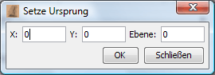

# Définir l'origine

Vous pouvez ici régler l'origine des coordonnées de la carte. La boîte de dialogue suivante s'affiche lorsque l'option de menu est sélectionnée :

Il vous suffit d'entrer les coordonnées de la région qui doit être à 0,0 à l'avenir et le niveau de CR (si disponible) pour lequel le changement doit s'appliquer. Les coordonnées de toutes les régions sont alors automatiquement ajustées.

**Cette fonction ne remplace pas la commande URSPRUNG ! Le serveur Eressea continue donc à livrer des CR avec les anciennes coordonnées, indépendamment des réglages effectués dans Magellan.
