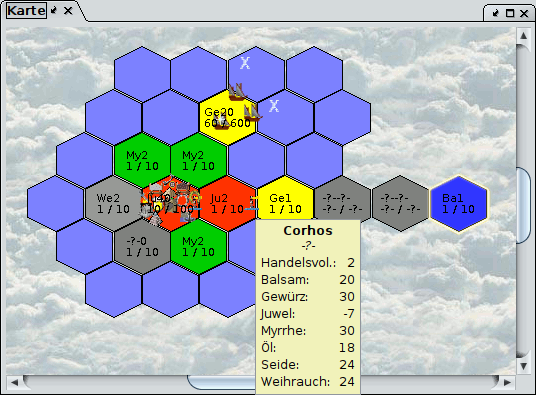

# ATR, ARR, infobulles et informations régionales

## Fonctionnalité

Le système de remplacement est en fait un type de langage de programmation qui permet de calculer certaines valeurs à partir des informations sur les régions. Le système de remplacement est utilisé pour l'ATR et l'ARR, ainsi que pour les infobulles sur la carte et les informations sur les régions dans l'affichage détaillé. L'ATR est utilisé pour étiqueter la carte. L'ARR permet de colorer les régions à l'aide d'une valeur numérique et d'une échelle de couleurs. Bien entendu, vous pouvez également combiner l'ATR, l'ARR et l'infobulle. Vous obtenez alors des régions colorées et des textes correspondants sur chaque région avec des informations supplémentaires facultatives. Les premières lignes de l'affichage détaillé peuvent également être configurées dans cette langue. L'illustration suivante montre une carte colorée et étiquetée en fonction des marchandises.

Quelles sont les possibilités de substitution ? Les mots suivants sont importants pour les infobulles. Un exemple est donné entre parenthèses. Il y a

* les variables (§herb).
* des variables composées (§item§Speer).
* des conditions (§if§not§isOcean§text1§else§text2§end§).
* les commutateurs composés (§faction§abcd). Restreindre la fonction des substituts suivants selon des critères définissables
* opérations arithmétiques (§+§3§2)
* chaînes de caractères (§ n'importe quel texte)

Une chaîne de définition (ligne) se compose désormais de plusieurs mots écrits l'un après l'autre, chacun étant précédé du séparateur §.

## Exemples simples

### Exemple : Texte avec variable

§Herbe §herbe conduit à la sortie Herbe Elfenlieb dans une région où pousse l'herbe Elfenlieb. Si Magellan reconnaît le mot (ici "herb"), il est remplacé par la valeur correspondante dans chaque région (ici "Elfenlieb"). Dans le cas contraire, le texte est simplement édité (ici "herb").

### Exemple : Compter les éléments

La variable composite §item§Item peut être utilisée pour afficher le nombre d'éléments. §item§Spear affiche le nombre de lances dans cette région. §item§Spear§ §item§Crossbow donne le nombre de lances suivi d'un espace suivi du nombre d'arbalètes. L'élément doit être écrit exactement comme il est nommé dans Magellan.

### Exemple : Non affiché sur les océans

Il est possible de limiter l'affichage à l'aide de la commande if. Par exemple, §if§not§isOcean§trees §trees garantit que le nombre d'arbres n'est affiché que dans les régions non océaniques. Cela rend les choses comme les arbres plus claires, puisque le mot arbres n'est pas affiché dans chaque champ océanique. Le §pas peut également être omis. Dans ce cas, il n'est affiché que dans les régions océaniques (ce qui n'a évidemment aucun sens avec les arbres). La syntaxe complète est §if\[§not\]§{condition}§{si la condition est vraie}§else§{si la condition est fausse}§fin.  
Ici, not est facultatif pour la négation. Les parenthèses curieuses incluant le contenu doivent être remplacées par la sortie souhaitée.

### Exemple : Restreindre le comptage aux unités d'une seule faction

Le commutateur composé §faction§nombre de factions limite le décompte des éléments à la faction spécifiée. Dans une région où la faction abcd possède 3 lances, §spear §faction§abcd§item§spear conduit à la sortie de la lance 3.

### Exemple : amical et toutes les personnes

Le commutateur composite §priv§confidence level restreint le comptage aux factions ayant le niveau de confiance spécifié. §priv§clear annule cette restriction. Les factions pour lesquelles le mot de passe est défini ont un niveau de confiance de 100. Un HELP ALL correspond à la valeur 60. Si vous voulez compter vos propres personnes et celles des autres, vous pouvez utiliser ce qui suit : §priv§100§Own §count§priv§clear§ | All §count .

### Exemple : Ajouter

La notation polonaise est utilisée, c'est-à-dire que les opérateurs arithmétiques sont écrits avant les deux opérandes (ou plus). §+§item§spear§item§crossbow additionne les lances et les arbalètes. Cette notation signifie qu'aucune parenthèse n'est nécessaire.  
a \* (b + c) en notation polonaise est \* a + b c, c'est-à-dire §\*§a§+§b§c ou aussi §\*§+§b§c§a
a \* b + c est + \* a b c, c'est-à-dire §+§\*§a§b§c ou encore §+§c§\*§a§b.

## Conseils et points d'achoppement

* Veillez à ce qu'il n'y ait pas d'espaces en fin de ligne. Ceux-ci empêchent la reconnaissance correcte des substituts. Il est préférable de placer un § au début et à la fin de la ligne pour éviter les erreurs. Toutefois, la syntaxe permet également d'omettre le § au début et à la fin de la ligne. Seul le mot herb fonctionne également.
* HTML peut être utilisé pour les info-bulles et les informations sur la région. Pour ce faire, toute la sortie doit être entourée de balises HTML, par exemple &lt;html&gt;&lt;body&gt;<b&gt;§rname§&lt;/b&gt ; &lt;i&gt;§herb§&lt;/i&gt;&gt ; &lt;/body>&lt;/html&gt ;.
§newline crée un saut de ligne dans l'ATR. Cependant, il est préférable d'écrire une infobulle entièrement en HTML ou d'utiliser un espace à la place du saut de ligne.
* Dans l'ARR, le résultat de l'expression entière doit être un nombre. Toute chaîne de caractères empêche une sortie correcte. Cela inclut également les retours à la ligne et les espaces.
* Si la syntaxe est incorrecte, vous ne recevrez pas de message d'erreur, mais seulement un résultat incorrect.
* Il est préférable de vérifier si la sortie de l'ARR est correcte à l'aide d'une infobulle correspondante.
* Un substitut qui compte quelque chose (par exemple des lances) le fait pour toutes les unités d'une région. Si vous voulez limiter ce comptage à vos propres unités, par exemple, vous devez utiliser des substituts restrictifs tels que priv ou faction.
* Un §clair après faction ou priv annule la restriction.
* Un espace est obtenu en plaçant un espace après §, par exemple §replacer§ §replacer
* Si, par exemple, vous ne voulez pas appeler le remplaçant herb mais produire la chaîne de caractères "herb", vous pouvez procéder comme suit : §\\herb§. Une barre oblique inverse "\\N" peut être éditée comme suit : §\\§

## Ce que les autres utilisent, téléchargements

Voici d'autres exemples de substituts utilisés par les utilisateurs de Magellan.

### Tooltip et ATR (Advanced Text Renderer)

| Nom | Description | Auteur |
|---------------------------------------------------------|--------------------------------------------------------------------------------------------------------|----------------------|
| [Carte commerciale](atr/Trade.atr) | Utiliser ATR en même temps que la carte commerciale ARR | Lars |
| L'ATR est un outil qui permet d'avoir une vue d'ensemble du commerce et des herbes, formaté](atr/fmzimmer.atr) | Fournit toutes les données que je veux connaître rapidement sans avoir à cliquer sur le nom de la province dans la liste. | Frank-Michael Zimmer

## AdvancedRegionShapeCellRenderer (ARR)

| Nom | Description | Auteur |
|-------------------------------------------------------|------------------------------------------------------------------------------------------------------------------------------------------------------------------------------------------------------------------------------------------------------------------------------------------------------------------------------------------------------------------------------------------------------------------------------------------------------------------------------------------------------------------------------------------------------------------------------------------------------------------------------------------------------------------------------------------------------------------------------------------------------------------------------|--------------|
| [Distribution des arbalètes](atr/CrossbowDistribution.arr) | Plus le rouge est foncé, plus il manque d'arbalètes. Plus le vert est foncé, plus il y a d'arbalètes dans la région.                                                                                                                                                                                                                                                                                                                                                                                                                                                                                                                                                                                                                                                         | Lars |
| L'avertissement de peste](atr/Pestwarnung.arr) | Indique le nombre d'emplois dont les paysans ont besoin (les unités de travail ne sont pas prises en compte).   jaune : beaucoup d'emplois disponibles  vert : quelques emplois disponibles  rouge : critique, pas assez d'emplois disponibles, danger de peste | Jochen Schuh |
| [Marchandises](atr/Einkaufsgut.arr) | Carte en couleur indiquant où acheter quelles marchandises.   Huile - marron  Encens - gris  Soie - blanc-bleu  Myrrhe - vert  Bijoux - rouge  Épices - jaune  Baume - bleu | Lars |
| [Herbes](atr/Kraeuter.arr) | Carte des herbes en couleur. Chaque terrain a une couleur de base qui varie en 3 niveaux de luminosité en fonction de l'herbe. Blanc pour l'océan. Violet si la région n'a pas encore été explorée. Couleurs, herbes et valeurs retournées pour les couleurs :  **Tons verts clairs** Audace épicée : 1, œil de hibou : 2, racine plate : 3, **Tons jaunes du désert** Pourriture de sable : 4, Water finder : 5, sueur de cactus : 6, **teintes orange des marais** Cornichon : 7, morille bulleuse : 8, salicaire noueuse : 9, **Tons rouges des hautes terres** Mandragore : 10, sac à vent : 11, croissance des fjords : 12, **teintes de gris des montagnes** cire de la brèche : 13, lueur de la grotte : 14, stonecrop : 15, **teintes turquoise des glaciers** râteau blanc : 16, cristal de neige : 17, fleur de glace : 18, **teintes bleues de la forêt** amour des elfes : 19, spinneret vert : 20, blue tree ringlet : 21 | Lars |

## Région info courte

Ceci peut être configuré sous Options - Affichage détaillé. Conseil : vous pouvez également utiliser la touche Entrée après chaque ligne pour plus de clarté.

NomDescriptionChiffreAuteur [L'original](atr/reginfoorig.txt)Paramètre par défaut

| | | | |
|----------------|-------------------------------------------------------------------------------------------------------------|---------------|----------------------------------------------------------------------------------------------|
| §peasants | §peasants | Mallorn/trees | §if§>§mallorn§0§mallorn§else§trees§end§ |
| recrues :      | §recruit | saplings :     | §sprouts |
| surplus :       | §if§<§peasants§maxWorkers§\*§peasants§-§peasantWage§10§else§-§\*§maxWorkers§peasantWage§\*§10§peasants§end§ | chevaux :       | §horses§ |
| Divertissement : | Fer/Laen | §if§<§0§laen§if§<§0§iron§iron§ / §laen§else§laen§end§else§if§<§0§iron§iron§else§-?-§end§end§.
| silver pool :   | §priv§100§item§silver§priv§clear§ | stones :       | §stones§ |
| Commerce :         | §maxtrade§ | Herb :         | §herb§ |

[Info région et faction](atr/reginfo2.txt)Ressources et possibilités de gagner de l'argent dans la région. Les informations sont partiellement incomplètes (par exemple, pas d'épées flamboyantes).

| | | | |
|--------------------|---------------------------------------------------------------------------------------------------------------------------------------------------------------|-----------------|-------------------------------|
| Les paysans sont les premiers à être recrutés par l'État.
| §if§<§peasants§maxWorkers§\*§peasants§§-§peasantWage§10§else§§-§\*§maxWorkers§peasantsWage§§\*§10§peasants§end§ | pool argent | §item§silver§ |
| Revenu potentiel | §\*§20§+§compétences§spectacle§compétences§collecte d'impôts§ | Bois | §item§bois§ |
| Armement §+§item§Spear§+§item§Hellard§+§item§Sword§+§item§War Axe§item§Bihänder§ / §+§item§Crossbow§+§item§Mallorn Crossbow§+§item§Bow§+§item§Catapult§item§Elven Bow§ | Chariot / Cheval | §item§Chariot§ / §item§Horse§ |
| Armure / Bouclier | §+§item§cotte de mailles§item§armure de plaques§ / §item§ bouclier§ | Fer / Pierre | §item§fer§ / §item§stone§ |
| Combattant §+§compétence§Armes de poing§compétence§Armes de jet§ / §+§compétence§Arbalète§+§compétence§Archerie§compétence§Utilisation de la catapulte§

Lars

## Liste de remplacement et explications avec exemples

| Explication - si rien d'autre n'est spécifié, le remplaçant s'applique à une région. Les paramètres doivent être spécifiés exactement comme ils sont affichés par Magellan. Ainsi, item§stone pour les pierres des unités. Pas item§stone et pas non plus item§stones | Exemple explicatif. Si aucun paramètre n'est spécifié, le nom du remplaçant suffit pour obtenir une sortie.
|---------------------------|----------------------------------------------------------------------------------------------------------------------------------------------------------------------------------------------------------------------------------|-------------------------------------------------------------------------------------------------------|
| Addition, soustraction, multiplication ou division de nombres. Utilise la notation polonaise, c'est-à-dire d'abord l'opérateur, puis les arguments.                                                                                                 | 3 + (paysans \* 3) = §+§3§\*§salaire§paysans |
| L'opérateur de calcul du salaire des paysans est un opérateur de calcul du salaire des paysans, qui retourne _vrai_ si la valeur du premier paramètre (si possible sous forme de nombre, sinon sous forme de chaîne) est inférieure à celle du second.                                                                                                     | Si la valeur du premier paramètre (si possible sous forme de nombre, sinon sous forme de chaîne de caractères) est inférieure à celle du second, §<§§5§paysans §<<§§5§paysans §<§§5§paysans
| cmd | Retourne le caractère §.                                                                                                                                                                                                         §cmd§ 1 de la Loi fondamentale §<§5§peasants §<§5§peasants §<§5§peasants
| cmd | Vérifie si le deuxième argument (sous forme de chaîne) est présent dans le premier (sous forme de chaîne). Il est sensible à la casse.                                                                                                                        | Le résultat est _vrai_ pour la région Lummerland : §contains§rname§land§ |
| contientIgnoreCase | Comme ci-dessus, mais en tenant compte de la casse.                                                                                                                                                                                                    | Le système renvoie _vrai_ pour la région Lummerland : §contains§rname§Land§ |
| Coordonnées | Renvoie les coordonnées de la région. Les coordonnées sont "x, y" au niveau 0, "x, y, z" aux autres niveaux.
| Nombre de personnes dans toutes les unités de la région. Peut être réduit à l'aide de filtres.                                                                                                                                                 | Nombre de personnes : §count |
Nombre de personnes : §count | Nombre d'unités : §countUnits | Nombre d'unités : §countUnits | Nombre d'unités : Nombre de personnes : §count | countUnits | Nombre d'unités : §countUnits
| Description | Fournit la description d'objets descriptibles tels que les régions ou les unités | Compte les "soldats" dans la région : §filter§contains§description§Soldat§count
| Divertissez-vous - Divertissement maximal possible tel que spécifié dans le CR - UnterhaltMax : §entertain - Divertissez-vous - Divertissement maximal possible tel que spécifié dans le CR - UnterhaltMax : §entertain
| Equals / EqualsIgnoreCase | Renvoie _vrai_ si les deux arguments sont identiques. La deuxième variante ignore les majuscules et les minuscules. Fonctionne pour les valeurs numériques et les chaînes de caractères, mais peut ne pas fonctionner si elles sont mélangées.                                             | La deuxième variante ignore les majuscules et les minuscules. Elle fonctionne pour les valeurs numériques et les chaînes de caractères, mais peut ne pas fonctionner si elles sont mélangées.   |
| faction | Limite les substituts suivants à la faction spécifiée. Indiquer le numéro de la faction. faction§clear annule la restriction.                                                                                                     | La fonction de la faction abcd et de toutes les factions est comptée : §faction§abcd§abcd : §count§faction§clear§ All : §comptage
| Filtre - Filtre - Filtre les unités sur la base d'un substitut transmis en tant que premier argument. Ce filtre est appliqué aux substituts tels que count. Il est annulé par §end.                                                                                                                                                                                                                                                                                                                                                                  | Ce filtre s'applique aux substituts tels que count : §filter§contains§description§soldier§count§end §filter§contains§description§soldier§count§end
| Herbier | Retourne l'herbe qui pousse dans la région.                                                                                                                                                                                                                                                                                                                                                                                                                                                                                               | |
| chevaux | nombre de chevaux
§if§condition§replacer1§end ou §if§condition§replacer1§else§replacer2§end. Si la condition est _vraie_, exécuter Replacer1. Peut être complété par else, puis Replacement2 est exécuté si la condition est _false_. L'imbrication est possible | Si moins de 100 chevaux, écrire "moins de 100", sinon écrire "supérieur ou égal à 100" : if§<§chevaux§§100§moins de 100§else§plus ou égal à 100§fin |
| Fer - fer non encore extrait - fer non encore extrait - fer non encore extrait - fer non encore extrait - fer non encore extrait - fer non encore extrait - fer non encore extrait
| niveau de fer | niveau actuel auquel le fer peut être extrait | | niveau de fer
| isActiveVolcano, isMountains etc.   | renvoie _vrai_ si le terrain de la région correspond au type spécifié | if§isLevel§La région est de niveau§else§La région n'est pas de niveau§end |
| Item | Numéro d'un item sur l'ensemble des unités. L'élément doit être spécifié exactement comme il est écrit dans le rapport. Peut être limité par des filtres.                                                                                                                                                                                                                                                                                                                                                                                | Article§Spear
| laen | pas encore exploité laen | | laenlevel
| laenlevel | le niveau actuel auquel le Laen peut être extrait | | laenlevel
| mallorn | Retourne la quantité de mallorn disponible en tant que ressource dans la région.                                                                                                                                                                                                                                                                                                                                                                                                                                                            | |
| mallornregion | retourne true si la région est une région de mallorn, false sinon.                                                                                                                                                                                                                                                                                                                                                                                                                                                                      | |
| maxWorkers | Nombre maximum de postes de travail disponibles, arbres pris en compte.                                                                                                                                                                                                                                                                                                                                                                                                                                                                         | |
| maxtrade | volume d'échange avant que les prix ne changent | |
| moral | moral des fermiers (E3) | | moral des fermiers (E3) | moral des fermiers (E3) | moral des fermiers (E3)
| nom | Renvoie le nom des objets pouvant être nommés. Il s'agit actuellement d'unités, de régions, de bâtiments, de navires, d'îles, de sorts et de potions. Dans le cadre d'une utilisation "normale", ce substitut renvoie le nom de la région actuelle. En relation avec les filtres d'unités, il renvoie toutefois le nom d'une unité, qui peut être utilisé pour le filtrage à l'aide d'une comparaison de chaînes de caractères/contenu.                                                                                                                                                    | Le nom d'une unité peut être utilisé pour le filtrage à l'aide d'une chaîne de caractères de comparaison/contenu.
| nouvelle ligne | Insère un saut de ligne. Ne fonctionne pas avec l'infobulle ; utiliser le HTML dans ce cas.                                                                                                                                                                                                                                                                                                                                                                                                                                                             | première ligne§saut de ligne§deuxième ligne
| pas | Négation de l'élément de remplacement. _true_ devient _false_ et _false_ devient _true_ | Souvent utilisé pour exclure l'océan : Souvent utilisé pour exclure l'océan :  if§not§isOcean§no ocean
| null | Retourne _vrai_ si l'argument est _null_, sinon _false_.                                                                                                                                                                                                                                                                                                                                                                                                                                                                        | Si l'argument est _null_, la réponse est _false_.
| oldHorses and other old... values | Returns the value from the previous round | oldHorses |
| op | op est un substitut paramétrique qui peut traiter _true_ ou _false_ en tant que paramètre. C'est l'abréviation de OperationSwitch (commutateur d'opération), qui permet de changer le mode d'opération des opérateurs. Si la valeur derrière "op" est _true_, les valeurs _null_\ (par exemple, les erreurs dans les calculs précédents ou les valeurs inconnues) sont interprétées comme 0, sinon comme incorrectes (et le calcul est annulé).  <Exemple : Une région voisine a un nombre inconnu d'arbres. Cela signifie que le résultat de /§trees§2 est "-?-". Mais §op§true§/§trees§2 renvoie 0. §op§true§+§iron§laen§op§false§ §op§true§+§iron§laen§op§false§ |
| Salaire des paysans | Salaire du travail pour les paysans en tenant compte de la prime de château | | Salaire des paysans | Salaire du travail pour les paysans en tenant compte de la prime de château
| paysans | nombre de paysans |
| PosX, posY, posZ | Retourne les coordonnées x, y ou z de la région.                                                                                                                                                                                                                                                                                                                                                                                                                                                                                     | Les coordonnées x, y ou z de la région sont les suivantes §posX§,§posY |
| Prix : §posX§,§posY | Prix d'un produit de luxe. Spécifier le produit de luxe comme dans Magellan.
| Priv Priv Priv Priv Priv Priv Priv Priv Priv Priv Priv Priv Priv Priv Priv Priv Priv Priv Priv Priv Priv Priv Priv Priv Priv Priv Priv Priv Priv Privilège les substituts suivants aux factions ayant un niveau de confiance minimum. Indiquez le niveau de confiance. Le niveau de confiance est affiché dans les statistiques de la faction. §priv§clear annule la restriction.                                                                                                                                                                                                                                                                                                                                | La restriction s'applique à toutes les personnes auxquelles HELP ALL a été attribué : priv§60§count.
| Les personnes à qui l'option HELFE ALL est attribuée (mais pas la leur) : privminmax§1§60§count
| recruter | Nombre maximum de recrues de la région | | nom de la région
| rname | nom de la région | | rtype | terrain, par ex.
| rtype | terrain, par ex. plaine | | silver | argent des paysans | | rtype | terrain, par ex. plaine | | argent des paysans | | rtype
rtype | terrain, par ex. plaine | silver | argent | argent des paysans | | skill
| compétence | Nombre de personnes ayant la compétence spécifiée.                                                                                                                                                                                                                                                                                                                                                                                                                                                                                     | skill§entertainment |
| skillmin | Nombre de personnes ayant une compétence avec le niveau minimum spécifié. Spécifiez le talent et le niveau | skillmin§entertainment§3 |
| Les niveaux de talent sont additionnés. Un niveau de talent minimum doit être présent pour être comptabilisé. Par exemple, pour déterminer la quantité de production possible, indiquez le talent et le niveau.                                                                                                                                                                                                                                                                                                                                                            | Compétences de base§ Bûcheronnage§2
| Pour déterminer la quantité de production possible, spécifiez le talent et le niveau.                                                                                                                                                                                                                                                                                                                                                                                                                                                                                                   | Compétences de base§ Commerce§2
| soldchar1 | Produit de luxe achetable, première lettre | | soldchar2 | Produit de luxe achetable, première lettre | | soldchar3
| soldchar2 | Produit de luxe achetable, deux premières lettres | | soldchar2 | Produit de luxe achetable, deux premières lettres
| soldname | Produit de luxe achetable, nom complet | | soldchar2 | Produit de luxe achetable, deux premières lettres | | soldchar3 | Produit de luxe achetable, nom complet
| soldprice | Produit de luxe achetable, prix d'achat ; valeur positive.                                                                                                                                                                                                                                                                                                                                                                                                                                                                                    | |
| germes | nombre de germes | | pierres |
| pierres | pierres non encore extraites | | pierres non encore extraites | | pierres non encore extraites
| Niveau des pierres | | Niveau auquel les pierres peuvent actuellement être extraites.
| substr | Retourne une partie d'une chaîne de caractères. Les deux premiers arguments sont start (inclusif) et end (exclusif), le troisième argument est la chaîne de caractères. Les valeurs négatives sont calculées à partir de la fin de la chaîne.                                                                                                                                                                                                                                                                                                           | Les valeurs négatives sont calculées à partir de la fin de la chaîne : §substr§0§2§rname§...§substr§-2§-1§rname §substr§2§-1§rname
| Tag - Spécifie le contenu d'une balise. Les balises peuvent être définies à l'aide d'outils ou via le menu contextuel de l'unité et de la région.                                                                                                                                                                                                                                                                                                                                                                                                                | Si la balise regionicon existe, elle peut être affichée comme suit : tag§regionicon |
Si la balise regionicon existe, elle peut être affichée comme suit : tag§regionicon | tagblank | Spécifie le contenu d'une balise. Spécifier le nom de la balise. Si le nom de la balise n'existe pas, une chaîne vide est renvoyée à la place de l'habituel -?- | tagblank§regionicon |
| arbres | nombre d'arbres | |
| salaire | salaire d'une personne pour les unités de joueurs | |
